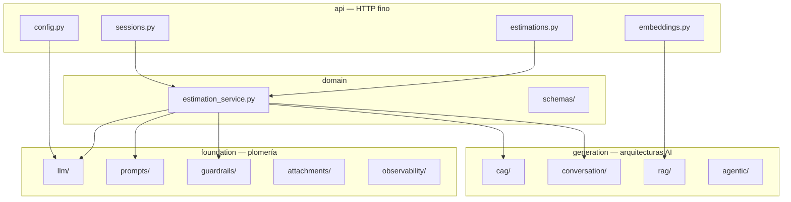
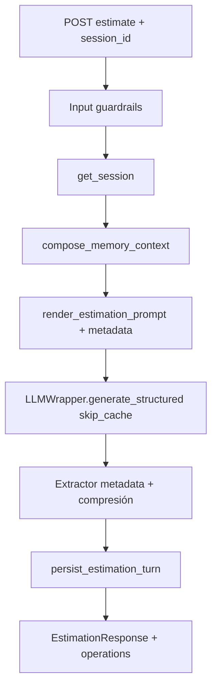

# Estimador CAG + RAG

FastAPI + Streamlit para estimar esfuerzo de desarrollo a partir de una **descripción estructurada del proyecto** (tipo y nivel de detalle). El backend inyecta contexto CAG con **plantillas Jinja2 v3** y few-shot JSON, aplica **guardrails multicapa** (defense-in-depth), genera un **`EstimationResult` validado** vía **Instructor + LiteLLM**, y responde en JSON con métricas operativas.

Incluye **memoria conversacional** multi-turno (`session_id`: historial con ventana deslizante, `project_metadata`, anclas y resumen acumulativo), **caché Redis** opcional (exacta + semántica), **pipeline RAG** con 8 estrategias de chunking, patrón **agéntico** Actor-Critic-Boss, y una **UI Streamlit** modular (chat, memoria, costes, observabilidad y preview de prompts).

**Monolito en `:8000`**: embeddings, estimaciones y sesiones viven en el mismo servicio FastAPI (sin microservicio `ai_service` ni puerto `8001`).

---

## Tabla de contenidos

- [Inicio rápido](#inicio-rápido-desarrollo-local)
- [Arquitectura](#arquitectura)
- [Pipeline de estimación](#pipeline-de-estimación)
- [Capas del backend](#capas-del-backend)
- [Contratos HTTP y schemas](#contratos-http-y-schemas)
- [Guardrails](#guardrails-appfoundationguardrails)
- [Caché Redis](#caché-redis-appgenerationcag)
- [Memoria conversacional](#memoria-conversacional-appgenerationconversation)
- [Adjuntos](#adjuntos-appfoundationattachments)
- [RAG y embeddings (S7)](#rag-y-embeddings-s7)
- [Interfaz Streamlit](#interfaz-streamlit-frontend)
- [Variables de entorno](#variables-de-entorno)
- [Logging estructurado](#logging-estructurado)
- [Tests](#tests-local)
- [Ejecutar API y Streamlit](#ejecutar-api)
- [Docker Compose](#ejecutar-con-docker-compose-desarrollo)
- [Guías de extensión](#guías-de-extensión)
- [Endpoints de referencia](#endpoints-de-referencia)

---

## Inicio rápido (desarrollo local)

```bash
cp .env.example .env          # claves OpenAI/Anthropic, LLM_MODEL, etc.
uv sync --dev
uv run python -m uvicorn app.main:app --reload   # terminal 1 → http://127.0.0.1:8000
uv run streamlit run streamlit_app.py            # terminal 2 → UI (ESTIMATOR_API_BASE_URL)
```

En la UI: **Nueva sesión** (sidebar) → escribe en el chat → revisa pestañas **Memoria**, **Costes**, **Observabilidad** y **Prompt**.

Con Docker (API + Redis):

```bash
cp .env.example .env
docker compose -f docker-compose-dev.yml up --build -d
# Streamlit sigue en el host:
uv run streamlit run streamlit_app.py
```

---

## Arquitectura

El servicio sigue un **monolito por capas** documentado en [`ARCHITECTURE.md`](ARCHITECTURE.md). La regla central: los módulos hermanos de `generation/` **no se importan entre sí**; se componen únicamente en el conductor [`app/domain/estimation_service.py`](app/domain/estimation_service.py). Los routers HTTP en `app/api/` son finos y delegan en ese servicio.



### Árbol del repositorio

```
app/                              # API FastAPI (monolito :8000)
├── main.py                       # FastAPI app, lifespan, routers
├── config.py                     # Settings (Pydantic BaseSettings)
├── dependencies.py               # Composition root (factories DI)
├── api/                          # Routers HTTP finos
│   ├── estimations.py            # POST /api/v1/estimate
│   ├── sessions.py               # POST/GET sessions, POST .../estimate (multipart)
│   ├── embeddings.py             # POST /embeddings/ingest, /embeddings/compare
│   └── config.py                 # GET/PUT /api/v1/config/models
├── domain/
│   ├── schemas/                  # Contratos HTTP (estimation_*, session)
│   ├── estimation_service.py     # Conductor del pipeline
│   └── exceptions.py             # Errores de dominio
├── foundation/
│   ├── llm/                      # wrapper LiteLLM, structured, pricing, runtime_config
│   ├── prompts/                  # registry, loader, plantillas Jinja2 (estimation/, critic/)
│   ├── guardrails/               # defense-in-depth + patterns/injection_v1.yaml
│   ├── attachments/              # Extracción PDF/DOCX
│   ├── observability/            # structlog, middleware, X-Request-ID, sync
│   └── persistence/              # Stub S8 (SQLAlchemy + pgvector)
├── generation/
│   ├── cag/                      # Caché exacta v2 + semántica (redisvl)
│   ├── conversation/             # Sesiones, metadata, compresión, tier rules
│   ├── rag/                      # Chunking (8 estrategias), embeddings, comparación
│   └── agentic/                  # Patrón Actor-Critic-Boss
├── ingestion/                    # Pipeline batch offline (stub S8)
└── fixtures/                     # Few-shot JSON para prompts CAG

frontend/                         # UI Streamlit (corre en el host, no en Docker)
├── app.py                        # Layout principal (5 pestañas)
├── api/                          # SessionClient, EstimationClient, métricas
├── state/                        # session_state, ui_state (st.session_state)
├── components/                   # chat, memory, metrics, observability, prompts, …
├── styles/                       # CSS + theme
└── utils/                        # formatting, cost_utils, charts

data/                             # Presupuestos de ejemplo para RAG
scripts/compare.py                # CLI comparación de chunking
streamlit_app.py                  # Launcher → frontend.app.run_app()

tests/
├── foundation/guardrails/        # Pipelines input/output, moderación, ataques
├── generation/
│   ├── cag/                      # Exacta, semántica, orquestador, claves
│   └── conversation/             # Store, TTL, extractor, sesiones, compresión
├── frontend/                     # Clientes HTTP, métricas, diffs (sin runtime ST)
└── test_*.py                     # Integración endpoint, prompts, logging, health
```

### Reglas de dependencias

| Capa | PUEDE importar | NO PUEDE importar |
|---|---|---|
| `foundation/*` | `config` | `domain`, `generation`, `ingestion`, `api` |
| `domain/schemas/*` | `config`, `foundation` | `generation`, `api` |
| `generation/*` | `config`, `foundation`, `domain/schemas` | `api`, **otro hermano de generation** |
| `domain/estimation_service.py` | todos los hermanos de `generation` + `foundation` | `api` |
| `api/*` | `dependencies`, `domain` | lógica de negocio |
| `dependencies.py` | cualquier capa | — |

---

## Pipeline de estimación

Toda la orquestación vive en [`EstimationService`](app/domain/estimation_service.py). Los routers solo validan HTTP, delegan y traducen excepciones a códigos de estado.

### Stateless (`POST /api/v1/estimate` sin `session_id`)

```
POST /api/v1/estimate
  │
  ├─ L1  Pydantic (EstimationRequest: longitud, enums)
  ├─ L2  Input guardrails (moderation → injection → PII)
  ├─ L3  Caché (exact → semantic) o miss
  ├─ L4  Render Jinja2 v3 + validación de prompts
  ├─ L5  Instructor + LiteLLM → EstimationResult (schema)
  ├─ L6  Output guardrails (validadores semánticos + filtros)
  └─     EstimationResponse (JSON + operations + métricas)
```

### Con sesión (`session_id` en body o vía `POST /sessions/{id}/estimate`)

Mismo flujo base, más:

1. Carga de sesión (`get_session`) — **404** / **410** si falta o expiró.
2. Composición de contexto de memoria (`compose_memory_context`: historial, anclas, resumen).
3. Render de `system.j2` con `project_metadata`, `running_summary`, `anchors`.
4. Mensajes LLM: system + historial (ventana) + user actual.
5. **`skip_cache=true`** — el contexto conversacional invalida hits de caché por descripción sola.
6. Tras la estimación: extractor de metadata, compresión (anclas + resumen), persistencia del turno.
7. Bloque `operations` con costes desglosados (estimación, memoria, compresión, caché embedding, guardrails).



---

## Capas del backend

### Foundation — plomería sin opinión de arquitectura AI

| Módulo | Ruta | Responsabilidad |
|---|---|---|
| **LLM** | `app/foundation/llm/` | `wrapper.py` (LiteLLM Router, caché store, reintentos), `structured.py` (Instructor), `pricing.py` (`MODEL_COSTS`, `cost_usd`), `prompt_builder.py`, `runtime_config.py` |
| **Prompts** | `app/foundation/prompts/` | `registry.py` (bundles v1/v2/v3), `loader.py` (Jinja2), plantillas en `estimation/{v1,v2,v3}/` y `critic/v1/` |
| **Guardrails** | `app/foundation/guardrails/` | Defense-in-depth: input/output pipelines, moderación, injection, PII, validadores, filtros |
| **Attachments** | `app/foundation/attachments/` | Extracción local PDF/DOCX, enriquecimiento de transcript |
| **Observability** | `app/foundation/observability/` | structlog, `RequestContextMiddleware`, `X-Request-ID`, handlers de excepción, `run_sync_with_context` |

**Prompts CAG** — bundle por defecto `estimation-v3-structured` (`DEFAULT_ESTIMATION_BUNDLE`):

| Recurso | Responsabilidad |
|---|---|
| `registry.py` | `PromptBundle` con `public_id` estable (contrato API / métricas) |
| `loader.py` | `render_estimation_prompt()`, `render_critic_prompt()`; few-shot vía `app/fixtures/estimation_examples/` |
| `estimation/v3/system.j2` | Bloques `<estimator_identity>`, `<project_metadata>`, refusal, anti-hallucination |
| `estimation/v3/user.j2` | `<project_description>` con tipo, detalle y alcance |

### Generation — arquitecturas de IA

| Subcapa | Ruta | Responsabilidad |
|---|---|---|
| **CAG** | `app/generation/cag/` | `orchestrator.py` (`lookup`/`store`), `exact.py`, `semantic.py`, `keys.py`, `policies.py`, `telemetry.py` |
| **Conversación** | `app/generation/conversation/` | `store.py` (SESSIONS in-process), `models.py`, `metadata_extractor.py`, `service.py`, `context_builder.py`, `tier_resolver.py`, `compression/` |
| **RAG** | `app/generation/rag/` | Chunking estructural + 8 estrategias, `embedding/embedder.py`, `analysis/comparison.py` |
| **Agéntica** | `app/generation/agentic/` | `boss.py`, `critic.py` — bucle Actor-Critic-Boss (extensible vía `estimate_with_acb`) |

### Domain — conductor y contratos

| Módulo | Responsabilidad |
|---|---|
| `estimation_service.py` | Único punto que compone CAG + conversación + guardrails + LLM |
| `schemas/estimation.py` | `EstimationRequest`, `EstimationResponse` (barrel re-export) |
| `schemas/estimation_operations.py` | `EstimationOperationsMetrics` — telemetría para UI |
| `schemas/session.py` | `SessionCreateResponse`, `SessionDetailResponse` |

### API — routers finos

| Router | Endpoints |
|---|---|
| `api/estimations.py` | `POST /api/v1/estimate` |
| `api/sessions.py` | `POST /api/v1/sessions`, `GET /api/v1/sessions/{id}`, `POST /api/v1/sessions/{id}/estimate` |
| `api/embeddings.py` | `POST /embeddings/ingest`, `POST /embeddings/compare` |
| `api/config.py` | `GET/PUT /api/v1/config/models` |

---

## Contratos HTTP y schemas

### Entrada — `EstimationRequest`

Definido en [`app/domain/schemas/estimation_request.py`](app/domain/schemas/estimation_request.py):

| Campo | Tipo | Descripción |
|---|---|---|
| `description` | `str` | 20–2000 caracteres |
| `project_type` | enum | `mobile_app`, `web_saas`, `internal_tool`, `data_pipeline` |
| `detail_level` | enum | `summary`, `medium`, `detailed` |
| `session_id` | `str \| null` | Activa historial + metadata; desactiva caché Redis |

### Salida — `EstimationResponse`

| Campo | Tipo | Descripción |
|---|---|---|
| `result` | `EstimationResult` | Fases, totales, `summary`, `reasoning` (Markdown) |
| `schema_version` | `str` | `estimation.v1` |
| `prompt_version` | `str` | Bundle CAG activo (`estimation-v3-structured`) |
| `model`, `provider` | `str` | Modelo y proveedor usados |
| `usage` | `TokenUsageResponse` | Tokens input/output/total |
| `cache_hit` | `bool` | Si la respuesta vino de caché |
| `cost_usd` | `float` | Coste de la llamada principal |
| `response_seconds` | `float` | Latencia de la petición |
| `operations` | `EstimationOperationsMetrics \| null` | Desglose operativo para UI |

`EstimationResult` ([`app/domain/schemas/estimation_output.py`](app/domain/schemas/estimation_output.py)) incluye validadores de negocio (suma de `cost_eur`, prefijo si baja confianza, etc.).

#### Bloque `operations` (métricas extendidas)

El backend expone telemetría desglosada en el campo **`operations`** (no `metrics`). La UI Streamlit lo parsea en [`frontend/api/metrics.py`](frontend/api/metrics.py); también acepta un bloque legacy `metrics` por compatibilidad.

```json
{
  "result": { "...": "..." },
  "cost_usd": 0.012,
  "usage": { "input_tokens": 100, "output_tokens": 50, "total_tokens": 150 },
  "operations": {
    "costs": {
      "estimation_usd": 0.012,
      "memory_extraction_usd": 0.004,
      "summary_compression_usd": 0.001,
      "guardrails_usd": 0.0,
      "cache_embedding_usd": 0.0001,
      "total_usd": 0.0171
    },
    "memory_extraction_executed": true,
    "summary_compression_executed": false,
    "guardrails_enabled": true,
    "semantic_cache_enabled": true,
    "cache_embedding_computed": true,
    "cache_hit": false,
    "cache_source": "none",
    "tier_decision": { "tier": "default", "rule_id": "..." }
  }
}
```

### Sesión — `SessionDetailResponse`

| Campo | Descripción |
|---|---|
| `session_id` | UUID |
| `history` | `list[Message]` — turnos user/assistant (ventana deslizante en servidor) |
| `project_metadata` | Hechos destilados persistentes |
| `anchors` | `list[AnchorItem]` — hechos anclados de alta confianza |
| `running_summary` | Resumen acumulativo comprimido |
| `created_at`, `updated_at` | Timestamps (TTL basado en `updated_at`) |

---

## Guardrails (`app/foundation/guardrails/`)

Capa de **defense-in-depth** separada de schemas de dominio y del router.

| Módulo | Responsabilidad |
|---|---|
| `input.py` | `run_input_guardrails()` — orquestador de entrada |
| `output.py` | `run_output_guardrails()` — orquestador de salida |
| `moderation.py` | OpenAI Moderation API (scores, thresholds, fail-open) |
| `injection.py` | Detección prompt injection (`patterns/injection_v1.yaml`) |
| `pii.py` | PII en entrada/salida (email, IBAN, teléfono, tarjetas, API keys) |
| `validators.py` | Coherencia coste/tiempo, fases, confidence |
| `filters.py` | `enforce_scope_response`, `build_safe_fallback` |
| `policies.py` | Aplicación de políticas de fallo |
| `prompts.py` | Validación post-render (tamaño, delimitadores XML) |
| `judge.py` | Hook LLM-as-judge (`NoOpOutputJudge` por defecto) |
| `telemetry.py` | Eventos structlog + contadores in-memory |
| `config.py` | `GUARDRAILS_VERSION` (versiona claves de caché) |

**Políticas de fallo** (`FailurePolicy`):

| Política | Comportamiento |
|---|---|
| `exception` | Bloquea la petición o falla el pipeline |
| `filter` | Reescribe/redacta y continúa |
| `retry` | Señal reintentable hacia el wrapper LLM |
| `log_only` | Solo telemetría; no bloquea |

**Orden en entrada:** moderación → injection → PII.

| Situación | HTTP |
|---|---|
| Violación input | **400** (`reason`: `moderation`, `prompt_injection`, `pii`) |
| Validación Pydantic | **422** |
| Output irrecuperable | **502** |
| Output degradado (FILTER) | **200** (mismo schema) |

**Versión de caché:** `CACHE_SCHEMA_VERSION = estimation.v1:guardrails.v1` en [`app/foundation/llm/wrapper.py`](app/foundation/llm/wrapper.py).

**Tests:** `tests/foundation/guardrails/`.

---

## Caché Redis (`app/generation/cag/`)

Coordinada por `EstimationCacheOrchestrator` ([`orchestrator.py`](app/generation/cag/orchestrator.py)):

- **Lecturas** (`lookup`): en `EstimationService` antes del LLM.
- **Escrituras** (`store`): en `LLMWrapper.generate_structured()` tras validar salida.

**Requisitos:** `REDIS_URL` definido. Semántica además exige `SEMANTIC_CACHE_ENABLED=true`, API key de embeddings y **Redis Stack** con RediSearch (`redis/redis-stack-server` en Compose).

### Lookup — orden

| Orden | Capa | Criterio de hit |
|---|---|---|
| 1 | **Exacta v2** | Clave `estimation:exact:v2:{schema_version}:{sha256(...)}` — descripción normalizada + bucket + modelo + tokens |
| 2 | **Semántica** | Mismo bucket; similitud coseno ≥ `SEMANTIC_CACHE_THRESHOLD` |

**Bucket compuesto** ([`keys.py`](app/generation/cag/keys.py)):

```
{prompt_version}:{project_type}:{detail_level}:{output_format}:{CACHE_SCHEMA_VERSION}
```

Los **output guardrails** se ejecutan siempre antes de devolver al cliente, incluso en cache hit.

### Variables de caché

| Variable | Default (`Settings`) | Descripción |
|---|---|---|
| `REDIS_URL` | vacío | Sin URL no hay orquestador |
| `CACHE_TTL_SECONDS` | `86400` | TTL caché exacta |
| `SEMANTIC_CACHE_ENABLED` | `false` | Activa índice vectorial |
| `SEMANTIC_CACHE_THRESHOLD` | `0.85` | Similitud mínima |
| `SEMANTIC_CACHE_LOG_ONLY` | `false` | Calibración sin servir hits |
| `SEMANTIC_EMBEDDING_MODEL` | `text-embedding-3-small` | Modelo embeddings |
| `SEMANTIC_EMBEDDING_DIMENSIONS` | `1536` | Dimensión del vector |

**Tests:** `tests/generation/cag/`.

---

## Memoria conversacional (`app/generation/conversation/`)

Sesiones multi-turno con **historial**, **metadata**, **anclas** y **resumen acumulativo**. La metadata son hechos destilados que sobreviven al truncado; el historial es registro bruto user/assistant con ventana deslizante.

| Módulo | Responsabilidad |
|---|---|
| `models.py` | `ProjectMetadata`, `Message`, `Session`, `AnchorItem`, `RunningSummary` |
| `store.py` | Store in-process `SESSIONS` (TTL, CRUD) — preparado para Redis/BBDD |
| `metadata_extractor.py` | `update_metadata_llm()` — fusiona hechos del turno |
| `service.py` | Ventana deslizante, persistencia de turnos |
| `context_builder.py` | `compose_memory_context()` para el prompt |
| `tier_resolver.py` | Reglas de tier para compresión/selectividad |
| `compression/` | Anclas (`anchors.py`) y resumen (`summary.py`) |

### Modelo de sesión

```
Session
├── session_id
├── history              # list[Message] — truncado por MAX_HISTORY_TURNS
├── project_metadata     # ProjectMetadata — inyectado en system prompt
├── anchors              # list[AnchorItem] — hechos anclados
├── running_summary      # RunningSummary — resumen comprimido
├── created_at
└── updated_at           # base del TTL (inactividad)
```

`ProjectMetadata`: `project_name`, `assumed_team_size`, `mentioned_technologies`, `agreed_scope`, `explicit_constraints`, `rejected_options`.

### Constantes

| Constante | Valor | Efecto |
|---|---|---|
| `SESSION_TTL_HOURS` | `24` | Expiración por inactividad |
| `MAX_HISTORY_TURNS` | `6` | Turnos user+assistant conservados |
| `MAX_ANCHORS` | `20` | Tope de anclas activas |
| `MAX_SUMMARY_CHARS` | `4000` | Tope del resumen acumulativo |

### Códigos HTTP (sesión)

| Situación | HTTP |
|---|---|
| `session_id` inexistente | **404** |
| Sesión expirada (TTL) | **410** |
| Fallo del extractor LLM | **502** |

**Caché:** con `session_id`, `skip_cache=true`.

**Reset:** `POST /api/v1/sessions` crea sesión vacía nueva.

**Inyección en prompt:** en `app/foundation/prompts/estimation/v3/system.j2`, bloque `<project_metadata>` solo con campos poblados. El loader acepta `project_metadata`, `running_summary` y `anchors` en `render_estimation_prompt()`.

**Tests:** `tests/generation/conversation/`.

---

## Adjuntos (`app/foundation/attachments/`)

Endpoint multipart: `POST /api/v1/sessions/{session_id}/estimate`.

| Aspecto | Detalle |
|---|---|
| Formatos | `.pdf`, `.docx` únicamente |
| Límites | `ATTACHMENTS_MAX_FILES` (default 5), `ATTACHMENTS_MAX_FILE_SIZE_MB` (default 10) |
| Flujo | Extracción local → enriquecimiento de transcript → estimación con contexto del archivo |
| Desactivar | `ATTACHMENTS_ENABLED=false` |

El cliente Streamlit envía `description`, `project_type`, `detail_level` y `files` vía [`frontend/api/estimation.py`](frontend/api/estimation.py).

---

## RAG y embeddings (S7)

Chunking estructural y **8 estrategias** comparables bajo `app/generation/rag/`:

1. `FixedSizeChunker`
2. `RecursiveChunker`
3. `SentenceWindowChunker`
4. `SemanticChunker`
5. `PropositionalChunker`
6. `ContextualRetrievalChunker`
7. `HierarchicalChunker`
8. `JSONStructuralChunker` (estructural, fuera del paquete `strategies/`)

| Endpoint | Descripción |
|---|---|
| `POST /embeddings/ingest` | Chunk + embed presupuestos JSON |
| `POST /embeddings/compare` | Compara estrategias de chunking |
| `GET/PUT /api/v1/config/models` | Overrides de modelos en runtime (Redis) |

Datos de ejemplo: [`data/budgets_sample.json`](data/budgets_sample.json), [`data/ingest_example_single_budget.json`](data/ingest_example_single_budget.json).

```bash
curl -X POST "http://127.0.0.1:8000/embeddings/ingest" \
  -H "Content-Type: application/json" \
  -d "@data/ingest_example_single_budget.json"

uv run python scripts/compare.py \
  --text-a "OAuth 2.0 authentication backend for fintech" \
  --text-b "JWT-based authorization service for banking app"
```

---

## Interfaz Streamlit (`frontend/`)

`uv run streamlit run streamlit_app.py` → [`frontend/app.py`](frontend/app.py). Copiloto **multi-sesión**, layout **wide**, CSS custom.

**Importante:** Streamlit corre **en el host**, no dentro del contenedor Docker. La pestaña **Prompt** renderiza Jinja2 **en proceso** (importa `app.foundation.prompts` desde la raíz del repo).

### Layout

```
┌─ Sidebar ─────────────────┐  ┌─ Main (tabs) ────────────────────────────────┐
│ Nueva sesión              │  │ [ Chat ] [ Memoria ] [ Costes ] [ Obs ] [ Prompt ] │
│ Lista sesiones (activa)   │  │                                                │
│ Renombrar / archivar      │  │  Contenido según pestaña                       │
│ Coste sesión / global     │  │                                                │
│ OpenAPI link              │  │                                                │
└───────────────────────────┘  └────────────────────────────────────────────────┘
```

| Pestaña | Función |
|---|---|
| **Chat** | Burbujas user/assistant, formulario (`text_area` + enviar), adjuntos PDF/DOCX |
| **Memoria** | `project_metadata`, anclas, resumen, timeline de snapshots, diffs, trazas extractor |
| **Costes** | Total global/sesión, desglose `operations.costs.*`, gráficos, `call_log` |
| **Observabilidad** | Payloads, caché, guardrails, `X-Request-ID` |
| **Prompt** | Preview local `render_estimation_prompt()` con metadata de sesión activa |

### Clientes HTTP y contrato

| Cliente | Endpoints usados |
|---|---|
| `SessionClient` | `POST /api/v1/sessions`, `GET /api/v1/sessions/{id}` |
| `EstimationClient` | `POST /api/v1/estimate`, `POST /api/v1/sessions/{id}/estimate` |

| Variable | Default | Uso |
|---|---|---|
| `ESTIMATOR_API_BASE_URL` | `http://localhost:8000` | Base URL del cliente HTTP |

**Flujo de datos:**

1. `POST /sessions` → guardar `session_id` en sidebar.
2. Usuario envía mensaje → `POST /estimate` con `session_id` (o multipart con adjuntos).
3. `GET /sessions/{id}` antes/después → diff de metadata en UI.
4. Campo `operations` de la respuesta → desglose en pestaña Costes.

**Imports acoplados al backend** (solo preview/validación local):

- `frontend/components/chat/chat_input.py` → `app.domain.schemas.estimation`
- `frontend/components/prompts/prompt_preview.py` → `app.foundation.prompts.loader`, `app.generation.conversation.models`

**Tests:** `tests/frontend/` (18 tests, sin ejecutar Streamlit en CI).

---

## Variables de entorno

Configuración en [`app/config.py`](app/config.py) vía `Pydantic BaseSettings` + `.env`.

### Core

| Variable | Obligatoria | Descripción |
|---|---|---|
| `APP_NAME` | sí | Nombre de la API |
| `APP_ENV` | sí | `dev`, `staging` o `prod` |
| `LOG_LEVEL` | sí | `DEBUG` … `CRITICAL` |
| `LLM_PROVIDER` | sí | `openai` o `anthropic` |
| `LLM_MODELS_BY_PROVIDER` | sí | JSON con modelos permitidos por proveedor |
| `LLM_MODEL` | sí | Modelo activo |
| `OPENAI_API_KEY` | si OpenAI | Clave OpenAI |
| `ANTHROPIC_API_KEY` | si Anthropic | Clave Anthropic |
| `TEMPERATURE` | no | Default `0.2` |
| `MAX_TOKENS` | no | Default `2000` (rango 100–4000) |
| `LLM_FALLBACK_MODEL` | no | Modelo alternativo LiteLLM |
| `LLM_TIMEOUT_SECONDS` | no | Default `30` |
| `LLM_NUM_RETRIES` | no | Default `2` |
| `ESTIMATOR_API_BASE_URL` | no | URL para Streamlit (default `http://localhost:8000`) |

### Caché y semántica

| Variable | Default | Descripción |
|---|---|---|
| `REDIS_URL` | vacío | p. ej. `redis://127.0.0.1:6379/0` |
| `CACHE_TTL_SECONDS` | `86400` | TTL caché exacta |
| `SEMANTIC_CACHE_ENABLED` | `false` | Caché vectorial |
| `SEMANTIC_CACHE_THRESHOLD` | `0.85` | Umbral similitud |
| `SEMANTIC_CACHE_LOG_ONLY` | `false` | Solo telemetría |
| `SEMANTIC_EMBEDDING_MODEL` | `text-embedding-3-small` | Modelo embeddings |

### Guardrails (prefijo `GUARDRAILS_`)

| Variable | Default | Descripción |
|---|---|---|
| `GUARDRAILS_ENABLED` | `true` | Interruptor global |
| `GUARDRAILS_MODERATION_ENABLED` | `true` | OpenAI Moderation |
| `GUARDRAILS_INJECTION_ENABLED` | `true` | Prompt injection |
| `GUARDRAILS_PII_INPUT_ENABLED` | `true` | PII en entrada |
| `GUARDRAILS_PII_OUTPUT_ENABLED` | `true` | PII en salida |
| `GUARDRAILS_OUTPUT_SEMANTIC_ENABLED` | `true` | Validadores post-LLM |
| `GUARDRAILS_FAIL_OPEN_ON_MODERATION_ERROR` | `true` | Continuar si moderación cae |
| `GUARDRAILS_OUTPUT_MAX_RETRIES` | `1` | Reintentos por salida inválida |
| `GUARDRAILS_PROMPT_MAX_CHARS` | `120000` | Tope system+user tras render |

Desactivar en tests locales: `GUARDRAILS_ENABLED=false` (el `conftest` de pytest lo hace por defecto).

### Memoria y adjuntos

| Variable | Default | Descripción |
|---|---|---|
| `MEMORY_ANCHORS_ENABLED` | `true` | Anclas de memoria |
| `MEMORY_SUMMARY_ENABLED` | `true` | Resumen acumulativo |
| `MEMORY_SUMMARY_MODEL` | `gpt-4o-mini` | Modelo de compresión |
| `ATTACHMENTS_ENABLED` | `true` | Adjuntos en sesión |
| `ATTACHMENTS_MAX_FILES` | `5` | Máximo archivos por petición |
| `ATTACHMENTS_MAX_FILE_SIZE_MB` | `10` | Tamaño máximo por archivo |
| `TIER_RULES_ENABLED` | `true` | Reglas de tier para compresión |

---

## Logging estructurado

**structlog** en [`app/foundation/observability/`](app/foundation/observability/) con salida a **stdout**.

| `APP_ENV` | Formato |
|---|---|
| `dev` | Consola coloreada |
| `staging`, `prod` | JSON una línea por evento |

| Componente | Archivo | Rol |
|---|---|---|
| Arranque | `observability/config.py` | `configure_logging()` en lifespan |
| Middleware | `observability/middleware.py` | `X-Request-ID`, eventos HTTP |
| Contexto | `observability/context.py` | `contextvars` + `bind_request_context` |
| Redacción | `observability/processors.py` | Omite descripciones, prompts, API keys |
| Handlers | `observability/exceptions.py` | 422, 400 guardrails, 502, 500 |
| Executor | `observability/sync.py` | `run_sync_with_context` para LLM en thread pool |

### Privacidad

- No se registran descripciones ni prompts completos.
- Solo hashes: `description_sha256`, `content_sha256`.
- Claves sensibles → `[REDACTED]`.

### Eventos habituales

| Evento | Categoría | Cuándo |
|---|---|---|
| `estimation_requested` / `estimation_completed` | business | Ciclo de estimación |
| `session_created` / `session_loaded` / `session_updated` | business | Memoria conversacional |
| `estimation_prompt_rendered` | technical | Tras Jinja2 |
| `llm_structured_started` / `completed` / `failed` | technical | Instructor |
| `cache_hit` / `cache_miss` / `semantic_cache_*` | technical | Caché Redis |
| `guardrail_policy_applied` | guardrails | Cada capa de guardrails |

```bash
docker compose -f docker-compose-dev.yml logs -f estimator
```

---

## Tests (local)

Los tests se ejecutan en el host con `uv sync --dev`; Docker levanta API + Redis para desarrollo, no para pytest.

```bash
uv sync --dev
uv run pytest                              # suite completa (~158 tests)
uv run pytest tests/foundation/guardrails -q
uv run pytest tests/generation/cag -q
uv run pytest tests/generation/conversation -q
uv run pytest tests/frontend -q            # 18 tests
```

| Suite | Qué cubre |
|---|---|
| `tests/foundation/guardrails/` | Pipelines input/output, moderación, injection, PII, ataques |
| `tests/generation/cag/` | Exacta, semántica, orquestador, claves, políticas |
| `tests/generation/conversation/` | Store, TTL, ventana, extractor, sesiones, compresión, tier |
| `tests/frontend/` | Clientes HTTP, `operations`, diffs metadata, prompt preview |
| `tests/test_*.py` | Endpoint, caché integración, prompts, logging, health |

Necesitas `.env` coherente (`OPENAI_API_KEY` si `LLM_PROVIDER=openai`). El `conftest` desactiva guardrails y simula LLM donde aplica.

---

## Ejecutar API

```bash
uv run python -m uvicorn app.main:app --reload
```

Health: `GET http://127.0.0.1:8000/health` → `{"status":"ok","environment":"dev"}`.

## Ejecutar interfaz Streamlit

Requiere la **API en marcha** (`:8000`).

```bash
# Opcional si ya es el default:
set ESTIMATOR_API_BASE_URL=http://127.0.0.1:8000   # Windows
export ESTIMATOR_API_BASE_URL=http://127.0.0.1:8000  # Linux/macOS

uv run streamlit run streamlit_app.py
```

---

## Ejecutar con Docker Compose (desarrollo)

[`docker-compose-dev.yml`](docker-compose-dev.yml): **Redis Stack** + **estimator** con hot-reload.

```bash
cp .env.example .env
docker compose -f docker-compose-dev.yml build
docker compose -f docker-compose-dev.yml up -d
```

| Servicio | Puerto | Rol |
|---|---|---|
| `redis` | `6379` | Redis Stack (RediSearch) para caché semántica |
| `estimator` | `8000` | API FastAPI con `REDIS_URL=redis://redis:6379/0` |

```bash
docker compose -f docker-compose-dev.yml logs -f estimator
docker compose -f docker-compose-dev.yml down
```

Notas:

- Volumen `./app:/app/app` para recarga en caliente.
- Streamlit **no** está en el compose; ejecútalo en el host.
- En Windows/Mac, si `--reload` no detecta cambios: `WATCHFILES_FORCE_POLLING=true`.

---

## Guías de extensión

### Nuevo modelo LLM

1. Añade proveedor y modelos en `LLM_MODELS_BY_PROVIDER`.
2. Precios en [`app/foundation/llm/pricing.py`](app/foundation/llm/pricing.py) (`MODEL_COSTS`).
3. Configura `LLM_MODEL` / `LLM_FALLBACK_MODEL`.

### Evolucionar prompts CAG

1. Plantillas bajo `app/foundation/prompts/estimation/<versión>/`.
2. Registra `PromptBundle` en [`app/foundation/prompts/registry.py`](app/foundation/prompts/registry.py).
3. Apunta `DEFAULT_ESTIMATION_BUNDLE` al `public_id` deseado.

### Extender guardrails

1. Patrones en `app/foundation/guardrails/patterns/injection_v1.yaml`.
2. Validadores en `validators.py`; filtros en `filters.py`.
3. Tras cambios de comportamiento: incrementa `GUARDRAILS_VERSION` en `config.py`.

### Persistir memoria fuera de proceso

1. Implementa backend alternativo con la interfaz de [`app/generation/conversation/store.py`](app/generation/conversation/store.py).
2. Modelos en `models.py` y contrato HTTP sin cambios.

### Evolucionar metadata

1. Extiende `ProjectMetadata` en `models.py`.
2. Actualiza `estimation/v3/system.j2` y `metadata_extractor.py`.
3. Tests en `tests/generation/conversation/`.

### Nuevo endpoint HTTP

1. Router fino en `app/api/`.
2. Factory en `dependencies.py` si hace falta.
3. Lógica de composición en `EstimationService` (no en el router).

---

## Endpoints de referencia

### `POST /api/v1/sessions`

```bash
curl -X POST "http://127.0.0.1:8000/api/v1/sessions"
# → { "session_id": "550e8400-e29b-41d4-a716-446655440000" }
```

### `GET /api/v1/sessions/{session_id}`

```json
{
  "session_id": "550e8400-e29b-41d4-a716-446655440000",
  "history": [
    { "role": "user", "content": "…" },
    { "role": "assistant", "content": "{…}" }
  ],
  "anchors": [],
  "running_summary": null,
  "project_metadata": {
    "project_name": "CRM Acme",
    "assumed_team_size": 3,
    "mentioned_technologies": ["React", "PostgreSQL"]
  },
  "created_at": "2026-05-20T10:00:00",
  "updated_at": "2026-05-20T10:05:00"
}
```

Errores: **404** (no existe), **410** (TTL expirado).

### `POST /api/v1/estimate`

```bash
curl -X POST "http://127.0.0.1:8000/api/v1/estimate" \
  -H "Content-Type: application/json" \
  -d "{\"description\":\"CRM pequeño con auth, contactos y roles. MVP orientativo seis semanas. Texto extra para superar el mínimo de 20 caracteres.\",\"project_type\":\"web_saas\",\"detail_level\":\"medium\"}"
```

Con sesión:

```bash
SESSION=$(curl -s -X POST "http://127.0.0.1:8000/api/v1/sessions" | jq -r .session_id)

curl -X POST "http://127.0.0.1:8000/api/v1/estimate" \
  -H "Content-Type: application/json" \
  -d "{\"description\":\"CRM con auth y contactos. Equipo de 3 devs. Stack React y PostgreSQL. Texto extra para validación.\",\"project_type\":\"web_saas\",\"detail_level\":\"medium\",\"session_id\":\"$SESSION\"}"
```

### `POST /api/v1/sessions/{session_id}/estimate` (multipart)

Estimación con adjuntos PDF/DOCX:

```bash
curl -X POST "http://127.0.0.1:8000/api/v1/sessions/$SESSION/estimate" \
  -F "description=Alcance detallado en el documento adjunto. Texto mínimo válido." \
  -F "project_type=web_saas" \
  -F "detail_level=medium" \
  -F "files=@scope.pdf"
```

### Meta y salud

| Método | Ruta | Descripción |
|---|---|---|
| `GET` | `/` | Info básica + links docs |
| `GET` | `/version` | Versión API |
| `GET` | `/health` | Estado (`ok`) |
| `GET` | `/ready` | Readiness (stub) |
| `GET` | `/docs` | OpenAPI Swagger UI |
| `POST` | `/embeddings/ingest` | Ingesta RAG |
| `POST` | `/embeddings/compare` | Comparar chunking |
| `GET/PUT` | `/api/v1/config/models` | Config runtime modelos |

---

## Documentación adicional

- [`ARCHITECTURE.md`](ARCHITECTURE.md) — contrato de capas y reglas de dependencia
- [`.env.example`](.env.example) — plantilla de variables sin secretos
- OpenAPI interactivo: `http://127.0.0.1:8000/docs`
