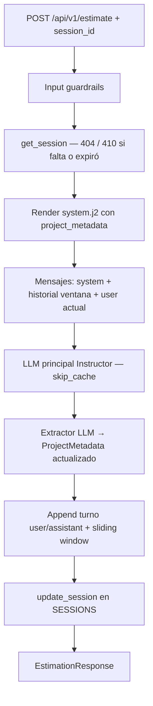
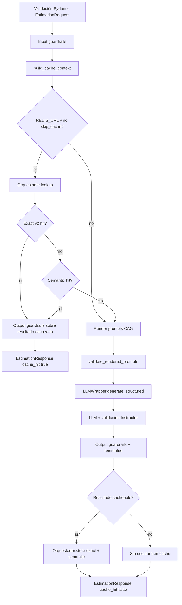

# Estimador CAG

FastAPI + Streamlit para estimar esfuerzo de desarrollo a partir de una **descripción estructurada del proyecto** (tipo y nivel de detalle). El backend inyecta contexto CAG con **plantillas Jinja2 v3** y few-shot JSON, aplica **guardrails multicapa** (defense-in-depth), genera un **`EstimationResult` validado** vía **Instructor + LiteLLM**, y responde en JSON con métricas.

Incluye **memoria conversacional** multi-turno (`session_id`: historial con ventana deslizante + `project_metadata` vía extractor LLM) y una **UI Streamlit** modular (chat, inspección de memoria, costes y observabilidad). Caché Redis opcional, fallback/reintentos, structlog y coste por tokens.

## Inicio rápido (desarrollo local)

```bash
cp .env.example .env          # claves OpenAI/Anthropic, LLM_MODEL, etc.
uv sync --dev
uv run python -m uvicorn app.main:app --reload   # terminal 1 → http://127.0.0.1:8000
uv run streamlit run streamlit_app.py            # terminal 2 → UI (ESTIMATOR_API_BASE_URL)
```

En la UI: **Nueva sesión** (sidebar) → escribe en el chat → revisa pestañas **Memoria**, **Costes** y **Observabilidad**.

## Arquitectura

```
app/                              # API FastAPI
├── routers/
│   ├── estimations.py            # POST /api/v1/estimate
│   └── sessions.py               # POST /api/v1/sessions, GET /api/v1/sessions/{id}
├── memory/                       # Sesiones, historial, metadata (store en proceso)
├── cache/                        # Caché exacta v2 + semántica (redisvl)
├── services/                     # llm_wrapper, structured_llm, llm_pricing, …
├── guardrails/                   # Defense-in-depth (input/output, moderation, PII, …)
├── prompts/                      # Bundles Jinja2 v3 (CAG)
├── schemas/                      # estimation_*, session (SessionDetailResponse)
├── logging/                      # structlog + X-Request-ID
├── fixtures/                     # Few-shot JSON
├── dependencies.py
└── config.py

frontend/                         # UI Streamlit modular
├── app.py                        # Layout principal (5 pestañas)
├── api/                          # SessionClient, EstimationClient, métricas
├── state/                        # session_state, ui_state (st.session_state)
├── components/
│   ├── chat/                     # Burbujas, chat_input, sidebar sesiones
│   ├── memory/                   # project_metadata, diff, trazas extractor
│   ├── metrics/                  # Dashboard costes, gráficos, tabla
│   ├── observability/            # Consola técnica (payloads, caché)
│   ├── estimation/               # Fases, reasoning
│   ├── prompts/                  # Preview Jinja2 local
│   └── common/                   # stat_card, badges, errores
├── styles/                       # CSS enterprise + theme
└── utils/                        # formatting, cost_utils, charts

streamlit_app.py                  # Launcher → frontend.app.run_app()

tests/
├── conversational_memory/        # Backend: store, TTL, extractor, prompts
├── frontend/                     # Clientes API, agregaciones, diffs (sin runtime ST)
├── guardrails/
└── cache/
```

### Pipeline de una estimación

**Sin `session_id`** (stateless, caché Redis si está configurada):

```
POST /api/v1/estimate
  │
  ├─ L1  Pydantic (EstimationRequest: longitud, enums)
  ├─ L2  Input guardrails (moderation → injection → PII)
  ├─ L3  Caché (exact → semantic) o miss
  ├─ L4  Render Jinja2 v3 + validación de prompts
  ├─ L5  Instructor + LiteLLM → EstimationResult (schema)
  ├─ L6  Output guardrails (validadores semánticos + filtros)
  └─     EstimationResponse (JSON + métricas)
```

**Con `session_id`:** mismo flujo, más carga/actualización de sesión, historial en el LLM, extractor de metadata y `skip_cache=true` (ver [Memoria conversacional](#memoria-conversacional-appmemory)).

Módulos clave en `app/services/`:

| Módulo | Responsabilidad |
|---|---|
| `llm_service.py` | Construcción de prompt CAG (system + user estructurado) |
| `llm_wrapper.py` | Wrapper LiteLLM con caché y retry |
| `app/cache/` | Caché exacta pre-render + semántica vectorial (`EstimationCacheOrchestrator`) |
| `llm_pricing.py` | Tabla de costes por modelo y estimación `cost_usd` |
| `structured_llm.py` | Validación de ``reasoning`` y utilidades Instructor |

Prompts CAG (`app/prompts/`):

| Recurso | Responsabilidad |
|---|---|
| `registry.py` | Bundles de estimación (`estimation-v3-structured` por defecto), constante `ESTIMATION_PROMPT_VERSION` (contrato API / métricas). |
| `loader.py` | Renderiza `system.j2` + `user.j2` con variables de la petición y resuelve includes (`examples.j2`, escenarios por `project_type`). |

Estructura típica de un bundle: `estimation/<versión>/system.j2`, `user.j2`, `examples.j2` y fixtures JSON en `app/fixtures/estimation_examples/`.

### Guardrails (`app/guardrails/`)

Capa de **defense-in-depth** separada de schemas de dominio y del router. Toda la lógica de moderación, regex e políticas vive aquí (no en endpoints).

| Módulo | Responsabilidad |
|---|---|
| `input.py` | Orquestador de entrada: `run_input_guardrails()` |
| `output.py` | Orquestador de salida: `run_output_guardrails()` |
| `moderation.py` | OpenAI Moderation API (scores, thresholds, fail-open) |
| `injection.py` | Detección de prompt injection (registry versionado) |
| `pii.py` | PII en entrada/salida (email, IBAN, teléfono, tarjetas, API keys) |
| `validators.py` | Coherencia coste/tiempo, fases, confidence, PII leak |
| `filters.py` | `enforce_scope_response`, `build_safe_fallback` (política FILTER) |
| `policies.py` | Aplicación de políticas de fallo |
| `prompts.py` | Validación post-render (tamaño, delimitadores XML) |
| `judge.py` | Hook LLM-as-judge (`NoOpOutputJudge` por defecto; extensible) |
| `telemetry.py` | Eventos structlog + contadores in-memory (Prometheus-ready) |
| `patterns/injection_v1.yaml` | Patrones de inyección versionables |

**Políticas de fallo** (`FailurePolicy`):

| Política | Comportamiento |
|---|---|
| `exception` | Bloquea la petición o falla el pipeline |
| `filter` | Reescribe/redacta y continúa (p. ej. baja confianza, PII en salida) |
| `retry` | Señal reintentable hacia el wrapper LLM |
| `log_only` | Solo telemetría; no bloquea |

**Orden en entrada** (por defecto): moderación → injection → PII.

**Códigos HTTP** relacionados:

| Situación | HTTP | Notas |
|---|---|---|
| Violación input (`InputGuardrailViolation`) | **400** | `reason`: `moderation`, `prompt_injection`, `pii` |
| Validación Pydantic del body | **422** | Sin cambios |
| Output irrecuperable | **502** | Alineado con fallos LLM |
| Output degradado (FILTER) | **200** | Mismo schema `EstimationResult` |

En `dev`, el detalle del 400 puede incluir el mensaje interno; en `staging`/`prod`, mensajes genéricos por `reason`.

**Versión de caché:** las claves Redis incluyen `guardrails.v1` además de `estimation.v1` (`CACHE_SCHEMA_VERSION` en `llm_wrapper.py`), de modo que cambios en guardrails invalidan entradas antiguas.

**Tests:** `tests/guardrails/` (unitarios, integración, regresión de ataques, snapshots). Los tests globales usan `guardrails_enabled=false` en `conftest`; la suite de guardrails activa flags estrictos.

### Memoria conversacional (`app/memory/`)

Sesiones multi-turno con **historial** y **metadata de proyecto** separados explícitamente. La metadata son hechos destilados que sobreviven al truncado del historial; el historial es el registro bruto user/assistant. **No** se mezclan ni se resume el historial: solo ventana deslizante. La actualización de metadata es **exclusivamente** vía extractor LLM (OpenAI Responses API + JSON schema); sin heurísticas, regex ni extracción por reglas.

| Módulo | Responsabilidad |
|---|---|
| `models.py` | `ProjectMetadata`, `Message`, `Session` (Pydantic, validación de tamaños) |
| `store.py` | Store en proceso `SESSIONS` (sin Redis/BBDD/ficheros), TTL, CRUD |
| `extractor.py` | `update_metadata_llm()` — Responses API, salida `ProjectMetadata` |
| `service.py` | Ventana deslizante, historial → mensajes LLM, persistencia de turnos |
| `constants.py` | `SESSION_TTL_HOURS=24`, `MAX_HISTORY_TURNS=6` |
| `exceptions.py` | `SessionNotFoundError`, `SessionExpiredError`, `MetadataExtractionError` |

**Persistencia actual:** solo memoria de proceso (`dict[str, Session]`). Preparado para sustituir el store por Redis/BBDD sin cambiar modelos ni contrato HTTP.

#### Modelo de sesión

```
Session
├── session_id          # UUID
├── history             # list[Message]  — user/assistant, truncado por sliding window
├── project_metadata    # ProjectMetadata — hechos persistentes (inyectados en system prompt)
├── created_at
└── updated_at          # base del TTL (inactividad)
```

`ProjectMetadata` (campos opcionales): `project_name`, `assumed_team_size`, `mentioned_technologies`, `agreed_scope`, `explicit_constraints`, `rejected_options`.

#### Pipeline con sesión (`session_id` en `EstimationRequest`)



| Paso | Dónde | Qué ocurre |
|------|--------|------------|
| 1 | Router | Validación Pydantic + input guardrails (igual que sin sesión). |
| 2 | `store.get_session()` | Carga sesión; si `updated_at` supera `SESSION_TTL_HOURS`, expira y se elimina (**410**). |
| 3 | `loader.render_estimation_prompt(..., project_metadata=…)` | Bloque `<project_metadata>` en `estimation/v3/system.j2` + instrucciones de autoridad. |
| 4 | `llm_wrapper.generate_structured(..., conversation_history=…)` | System + últimos `MAX_HISTORY_TURNS` turnos + mensaje user de la petición. |
| 5 | `extractor.update_metadata_llm()` | Tras la estimación, fusiona hechos del turno (user + JSON assistant) en metadata. |
| 6 | `service.persist_estimation_turn()` | Añade turno al historial, trunca, persiste metadata y sesión. |

**Caché:** si hay `session_id`, `skip_cache=true` (el contexto conversacional invalida hits exactos/semánticos por descripción sola).

**Reset explícito:** `POST /api/v1/sessions` crea una sesión vacía nueva; no reutiliza memoria de sesiones anteriores.

#### Inyección en el prompt

En `app/prompts/estimation/v3/system.j2`, tras `<estimator_identity>`, se renderiza `<project_metadata>` solo con campos poblados. Instrucción fija: tratar metadata como hechos establecidos y no contradecirlos salvo revisión explícita del usuario.

El loader acepta `project_metadata: ProjectMetadata | None` en `render_estimation_prompt()`.

#### Constantes y TTL

| Constante | Valor | Efecto |
|---|---|---|
| `SESSION_TTL_HOURS` | `24` | Expiración por inactividad (`updated_at`) |
| `MAX_HISTORY_TURNS` | `6` | Máximo de turnos user+assistant conservados |

- `cleanup_expired_sessions()` purga sesiones vencidas de forma programática.
- Al cargar una sesión expirada: **410 Gone**, entrada eliminada del store.

#### Códigos HTTP (sesión)

| Situación | HTTP |
|---|---|
| `session_id` inexistente | **404** |
| Sesión expirada (TTL) | **410** |
| Fallo del extractor LLM | **502** (`Metadata extraction failed`) |

#### Eventos structlog (`log_category=business` / `technical`)

| Evento | Cuándo |
|---|---|
| `session_created` / `session_loaded` / `session_updated` / `session_deleted` | Ciclo de vida en store |
| `session_expired` / `session_expired_cleanup` | TTL al leer o en limpieza |
| `history_truncated` | Tras aplicar ventana deslizante |
| `metadata_extraction_started` / `completed` / `failed` | Extractor LLM |
| `metadata_revised` | Metadata cambió tras un turno |

**Tests:** `tests/conversational_memory/` — store, ventana, extractor (mock), revisión de hechos, inyección en prompt, TTL, reset vía `POST /sessions`, `GET /sessions/{id}`, integración con `/estimate`.

#### API de sesiones (contratos)

| Método | Respuesta | Contenido |
|--------|-----------|-----------|
| `POST /api/v1/sessions` | `SessionCreateResponse` | `{ "session_id": "uuid" }` |
| `GET /api/v1/sessions/{session_id}` | `SessionDetailResponse` | `session_id`, `history[]`, `project_metadata`, `created_at`, `updated_at` |

La UI Streamlit usa **GET** tras cada estimación para sincronizar `project_metadata` y construir diffs de memoria sin heurísticas en el cliente.

## Requisitos

- Python 3.11+
- `uv` instalado
- API key de OpenAI o Anthropic (OpenAI también para el extractor de metadata si usas `session_id`)

## Instalación

Solo dependencias de runtime (API):

```bash
uv sync
```

Con herramientas de desarrollo y tests (`pytest`, `httpx` para `TestClient`):

```bash
uv sync --dev
```

Configura entorno:

```bash
cp .env.example .env
```

## Variables de entorno

La configuración se carga con `Pydantic BaseSettings` desde `app/config.py` y toma valores de `.env`.

| Variable | Obligatoria | Descripción |
|---|---|---|
| `APP_NAME` | sí | Nombre de la API |
| `APP_ENV` | sí | `dev`, `staging` o `prod` |
| `LOG_LEVEL` | sí | `DEBUG`, `INFO`, `WARNING`, `ERROR` o `CRITICAL` |
| `LLM_PROVIDER` | sí | Proveedor activo: `openai` o `anthropic` |
| `LLM_MODELS_BY_PROVIDER` | sí | JSON con lista de modelos permitidos por proveedor |
| `LLM_MODEL` | sí | Modelo activo (debe estar en la lista del proveedor) |
| `OPENAI_API_KEY` | si `LLM_PROVIDER=openai` | Clave de API de OpenAI |
| `ANTHROPIC_API_KEY` | si `LLM_PROVIDER=anthropic` | Clave de API de Anthropic |
| `TEMPERATURE` | no | Entre `0.0` y `1.0` (default `0.2`) |
| `MAX_TOKENS` | no | Entre `100` y `4000` (default `800`) |
| `REDIS_URL` | no | p. ej. `redis://127.0.0.1:6379/0`; vacío = sin caché |
| `CACHE_TTL_SECONDS` | no | TTL de caché en segundos (default `86400`) |
| `LLM_FALLBACK_MODEL` | no | Modelo alternativo para fallback LiteLLM |
| `LLM_TIMEOUT_SECONDS` | no | Timeout de llamada al LLM (default `120`) |
| `LLM_NUM_RETRIES` | no | Reintentos ante error (default `2`) |
| `ESTIMATOR_API_BASE_URL` | no | URL base que usa Streamlit (default `http://localhost:8000`) |

### Guardrails

Todas las variables usan prefijo `GUARDRAILS_` (case-insensitive en `.env`). Definidas en `app/config.py`.

| Variable | Default | Descripción |
|---|---|---|
| `GUARDRAILS_ENABLED` | `true` | Interruptor global |
| `GUARDRAILS_MODERATION_ENABLED` | `true` | OpenAI Moderation API (requiere `OPENAI_API_KEY`) |
| `GUARDRAILS_INJECTION_ENABLED` | `true` | Heurísticas prompt injection (`patterns/injection_v1.yaml`) |
| `GUARDRAILS_PII_INPUT_ENABLED` | `true` | PII en descripción de entrada |
| `GUARDRAILS_PII_OUTPUT_ENABLED` | `true` | PII en `summary` / `reasoning` (redacción FILTER) |
| `GUARDRAILS_OUTPUT_SEMANTIC_ENABLED` | `true` | Validadores semánticos post-LLM |
| `GUARDRAILS_MODERATION_LOG_ONLY` | `false` | Solo log si moderación falla (no bloquea) |
| `GUARDRAILS_INJECTION_LOG_ONLY` | `false` | Solo log si detecta injection |
| `GUARDRAILS_PII_INPUT_LOG_ONLY` | `false` | Solo log si detecta PII en entrada |
| `GUARDRAILS_MODERATION_MODEL` | `omni-moderation-latest` | Modelo de moderación OpenAI |
| `GUARDRAILS_MODERATION_THRESHOLDS` | `{}` | JSON `{"categoria": 0.8}` para bloquear por score |
| `GUARDRAILS_INJECTION_PATTERN_VERSION` | `v1` | Versión del YAML de patrones |
| `GUARDRAILS_FAIL_OPEN_ON_MODERATION_ERROR` | `true` | Si la API de moderación cae, continuar (log warning) |
| `GUARDRAILS_OUTPUT_MAX_RETRIES` | `1` | Reintentos LLM ante `OutputGuardrailRetryable` |
| `GUARDRAILS_JUDGE_ENABLED` | `false` | Hook LLM-as-judge (NoOp por defecto) |
| `GUARDRAILS_MIN_EUR_PER_HOUR` | `20` | Banda mínima EUR/h implícita por fase |
| `GUARDRAILS_MAX_EUR_PER_HOUR` | `250` | Banda máxima EUR/h implícita por fase |
| `GUARDRAILS_HOURS_PER_WEEK` | `40` | Referencia para coherencia temporal |
| `GUARDRAILS_PROMPT_MAX_CHARS` | `120000` | Tope de tamaño system+user tras render |

Para **desactivar guardrails en tests locales** sin tocar producción: `GUARDRAILS_ENABLED=false` (el `conftest` de pytest ya lo hace por defecto).

## Logging estructurado

La API usa **structlog** (`app/logging/`) con salida a **stdout** (Docker/Kubernetes, ELK, Loki, Datadog).

| `APP_ENV` | Formato |
|---|---|
| `dev` | Consola coloreada (`ConsoleRenderer`) |
| `staging`, `prod` | JSON una línea por evento (`JSONRenderer`) |

### Configuración y pipeline

| Componente | Archivo | Rol |
|---|---|---|
| Arranque | `logging/config.py` | `configure_logging(settings, version)` en lifespan |
| Middleware | `logging/middleware.py` | `X-Request-ID`, `http_request_started` / `completed` |
| Contexto | `logging/context.py` | `contextvars` + `bind_request_context` |
| Redacción | `logging/processors.py` | Omite `description`, `messages`, `api_key`, etc. |
| Handlers | `logging/exceptions.py` | 422, 400 guardrails, 502, 500 |
| Executor | `logging/sync.py` | `run_sync_with_context` para LLM en thread pool |

### Campos habituales en cada evento

- `request_id`, `http_method`, `http_path` (peticiones HTTP)
- `log_category`: `business` | `technical` | `guardrails`
- `service`, `app_env`, `version` (metadatos de servicio)
- `trace_id`, `span_id` (reservados OTel; `null` hasta integrar SDK)
- Errores: `error_type`, `error_message`, `error_recoverable`, `critical`

### Privacidad en logs

- **No** se registran descripciones ni prompts completos.
- Solo hashes: `description_sha256`, `content_sha256` (prompt renderizado).
- Claves en `_SENSITIVE_KEYS` se sustituyen por `[REDACTED]` (`api_key`, `authorization`, `content`, etc.).

### Eventos de negocio y LLM

| Evento | Categoría | Cuándo |
|---|---|---|
| `estimation_requested` | business | Inicio `POST /estimate` (incluye `session_id` si aplica) |
| `estimation_completed` | business | Éxito con métricas |
| `session_created` / `session_loaded` / `session_updated` | business | Memoria conversacional |
| `session_expired` | business | TTL al cargar sesión |
| `history_truncated` | business | Ventana deslizante aplicada |
| `metadata_extraction_*` / `metadata_revised` | technical / business | Extractor LLM de metadata |
| `estimation_failed` | business | Fallo no recuperable |
| `estimation_validation_failed` | business | `ReasoningLengthError` |
| `estimation_prompt_rendered` | technical | Tras Jinja2 |
| `llm_structured_started` / `completed` / `failed` | technical | Ciclo Instructor |
| `cache_hit` / `cache_miss` / `cache_stored` | technical | Redis exacta |
| `semantic_cache_lookup` / `semantic_cache_hit` / `semantic_cache_miss` / `semantic_cache_store` | technical | Redis Stack |
| `semantic_cache_hit_log_only` / `semantic_cache_similarity_below_threshold` | technical | Calibración semántica |
| `reasoning_truncated` | technical | Recorte suave de `reasoning` |

### Eventos de guardrails (`log_category=guardrails`)

| Evento | Cuándo |
|---|---|
| `guardrail_policy_applied` | Tras cada capa (nombre, política, passed) |
| `guardrail_check_completed` | Fin de capa (debug, `latency_ms`) |
| `moderation_flagged` | Contenido marcado por OpenAI |
| `moderation_scores_recorded` | Scores por categoría |
| `moderation_call_failed` | Error de red/API (fail-open si configurado) |
| `prompt_injection_detected` | Patrón regex coincidente |
| `pii_detected` | Tipos de PII encontrados |
| `input_guardrail_blocked` | HTTP 400 |
| `enforce_scope_response_filtering` | Salida reescrita por baja confianza |
| `output_pii_redacted` | PII redactado en salida |
| `llm_retry_triggered` | Reintento por validador semántico |
| `output_guardrail_retry_exhausted` | Fallback seguro tras agotar reintentos |

Contadores en memoria: `app/guardrails/telemetry.py` → `get_guardrail_metrics()` (exportables a Prometheus más adelante).

### Consultar logs

```bash
docker compose -f docker-compose-dev.yml logs -f estimator
```

En **staging/prod**, filtrar por correlación:

```text
request_id:"<uuid>"
log_category:guardrails
```

Ejemplo de evento JSON (prod):

```json
{
  "event": "guardrail_policy_applied",
  "log_category": "guardrails",
  "guardrail_name": "prompt_injection",
  "policy": "exception",
  "passed": false,
  "request_id": "a1b2c3d4-...",
  "timestamp": "2026-05-19T12:00:00.000000Z"
}
```

Notas:

- `.env.example` documenta todas las variables sin secretos.
- `.env` contiene los valores reales locales y está ignorado por git.
- Si `LLM_PROVIDER` no existe en `LLM_MODELS_BY_PROVIDER` o `LLM_MODEL` no pertenece a ese proveedor, la app falla al arrancar con error de validación.
- Si faltan API keys según el proveedor elegido, la app falla al arrancar con un error de validación claro.
- Si defines `LLM_FALLBACK_MODEL`, la validación exige también la API key del proveedor que corresponda al modelo principal **y** al de fallback (OpenAI y/o Anthropic según aplique).

## Tests (local)

Los tests se ejecutan en tu máquina con el entorno de desarrollo; **`docker-compose-dev.yml` levanta la API y Redis para desarrollo** (no instala ni lanza `pytest` en contenedor).

```bash
uv sync --dev
pytest
# Solo guardrails:
pytest tests/guardrails -q
# Solo memoria conversacional:
pytest tests/conversational_memory -q
# Solo frontend (utilidades y clientes API):
pytest tests/frontend -q
```

Algunos tests importan `app.main` y disparan la validación de `Settings`: necesitas un `.env` coherente (por ejemplo `OPENAI_API_KEY` si `LLM_PROVIDER=openai`). Los tests del endpoint simulan el LLM con `monkeypatch`; `tests/guardrails/` cubre moderación (mock), injection, PII, políticas, integración 400 y regresión de ataques.

| Suite | Qué cubre |
|-------|-----------|
| `tests/conversational_memory/` | Store, TTL, ventana, extractor, prompt metadata, `GET`/`POST` sesiones |
| `tests/frontend/` | Clientes HTTP, agregación de costes, diffs metadata, parsing métricas |
| `tests/guardrails/` | Pipelines input/output, moderación, ataques |
| `tests/cache/` | Exacta, semántica, orquestador |

## Servicio LLM (CAG + Instructor + guardrails)

- `system` / `user`: plantillas v3 (`estimation-v3-structured`) con bloques `<scope>`, refusal, anti-hallucination y few-shot JSON desde `app/fixtures/estimation_examples/`.
- **Entrada:** `run_input_guardrails()` antes de renderizar; **salida:** `run_output_guardrails()` tras Instructor (también en cache hit).
- Salida: **Instructor** (`instructor.from_litellm`) con `response_model=EstimationResult`; reintentos Pydantic + reintentos por guardrails de salida (`GUARDRAILS_OUTPUT_MAX_RETRIES`).
- Proveedor: `LLM_PROVIDER` + `LLM_MODEL`; fallback opcional vía `LLM_FALLBACK_MODEL`.

### Contrato de entrada (`EstimationRequest`)

Definido en `app/schemas/estimation_request.py`:

| Campo | Tipo | Descripción |
|---|---|---|
| `description` | `str` | 20–2000 caracteres |
| `project_type` | enum | `mobile_app`, `web_saas`, `internal_tool`, `data_pipeline` |
| `detail_level` | enum | `summary`, `medium`, `detailed` (afecta longitud de `reasoning` en el prompt) |
| `session_id` | `str \| null` | Opcional. Activa historial + metadata; desactiva caché Redis para esa petición |

Sin `session_id` el comportamiento es el de siempre (stateless, caché según `REDIS_URL`).

### Contrato de salida (`EstimationResponse`)

| Campo | Tipo | Descripción |
|---|---|---|
| `result` | `EstimationResult` | Fases, totales, `summary`, `reasoning` (Markdown) |
| `schema_version` | `str` | `estimation.v1` |
| `prompt_version` | `str` | Bundle CAG activo (`estimation-v3-structured`) |
| `model`, `provider`, `usage`, `cache_hit`, `cost_usd`, … | | Métricas operativas |

`EstimationResult` (en `app/schemas/estimation_output.py`) incluye validadores de negocio (suma de `cost_eur`, prefijo si baja confianza, etc.).

#### Métricas extendidas (opcional, UI preparada)

El frontend interpreta un bloque opcional en la respuesta de estimación:

```json
{
  "result": { "…": "…" },
  "cost_usd": 0.012,
  "usage": { "input_tokens": 100, "output_tokens": 50, "total_tokens": 150 },
  "metrics": {
    "costs": {
      "estimation_usd": 0.012,
      "memory_extraction_usd": 0.004,
      "guardrails_usd": 0.001,
      "cache_embedding_usd": 0.000
    },
    "tokens": { "estimation": { "input": 100, "output": 50 } },
    "latency": { "estimation_ms": 1200 }
  }
}
```

Si `metrics` no está presente, la UI usa `cost_usd` de la estimación y deriva el diff de memoria vía `GET /sessions/{id}`.

### Caché Redis (exacta + semántica)

La caché vive en `app/cache/` y se coordina con `EstimationCacheOrchestrator` (`orchestrator.py`). El router [`app/routers/estimations.py`](app/routers/estimations.py) hace las **lecturas**; [`app/services/llm_wrapper.py`](app/services/llm_wrapper.py) hace las **escrituras** tras validar la salida del LLM.

**Requisitos:** `REDIS_URL` definido. La capa semántica además exige `SEMANTIC_CACHE_ENABLED=true`, API key del proveedor de embeddings (p. ej. OpenAI) y **Redis Stack** con RediSearch (`redis/redis-stack-server` en `docker-compose-dev.yml`).

#### Pipeline completo de una estimación



| Paso | Dónde | Qué ocurre |
|------|--------|------------|
| 1 | Router | Validación del body y **input guardrails** (siempre; la caché no los omite). |
| 2 | Router | `build_cache_context()` con descripción ya saneada, bundle CAG, modelo, `max_tokens`, `thinking_budget`, `CACHE_SCHEMA_VERSION`. |
| 3 | Router | **`orchestrator.lookup(cache_ctx)`** — ver tabla siguiente. |
| 4a | Router | Si **hit** (exact o semantic): `run_output_guardrails()` sobre el `EstimationResult` recuperado y respuesta con `cache_hit: true` (**sin render ni LLM**). |
| 4b | Router | Si **miss**: render de prompts, validación de prompts, llamada a `generate_structured()`. |
| 5 | LLMWrapper | LLM, validación estructurada y **output guardrails** (con reintentos si aplica). |
| 6 | LLMWrapper | **`orchestrator.store()`** solo si la respuesta es cacheable — ver políticas de escritura. |

Los **output guardrails** se ejecutan siempre antes de devolver al cliente, tanto en hit como en miss. Un hit de caché **nunca** salta guardrails de salida.

#### Verificaciones (lookup) — orden y condiciones

`EstimationCacheOrchestrator.lookup()` en [`app/cache/orchestrator.py`](app/cache/orchestrator.py) solo corre si `REDIS_URL` está configurado y `skip_cache` es falso (`app/cache/policies.py`).

| Orden | Capa | Módulo | Condición de activación | Criterio de hit |
|-------|------|--------|-------------------------|-----------------|
| 1 | **Exacta v2** | `app/cache/exact.py` | Siempre que haya Redis y lectura permitida | Clave Redis `estimation:exact:v2:{schema_version}:{sha256(...)}` con JSON del payload; coincide descripción **normalizada** + bucket + `model` + `max_tokens` + `thinking_budget`. |
| 2 | **Semántica** | `app/cache/semantic.py` | Solo si exact miss **y** `SEMANTIC_CACHE_ENABLED=true` **y** el índice vectorial se inicializó | Mismo **bucket** tag; similitud coseno ≥ `SEMANTIC_CACHE_THRESHOLD` (default `0.92`). Un embedding por lookup (reutilizado en store si hay miss). |

**Bucket compuesto** (aislamiento entre prompts, formatos y configuraciones), definido en [`app/cache/keys.py`](app/cache/keys.py):

```
{prompt_version}:{project_type}:{detail_level}:{output_format}:{CACHE_SCHEMA_VERSION}
```

- `prompt_version`: `public_id` del bundle (p. ej. `estimation-v3-structured`).
- `output_format`: `line_items` (bundles v1/v2) o `structured` (v3).
- `CACHE_SCHEMA_VERSION`: `estimation.v1:guardrails.v1` — cambios en guardrails o schema invalidan entradas antiguas sin borrado manual.

**Comportamiento semántica en lookup:**

| Situación | Efecto en la petición | Evento structlog (técnico) |
|-----------|------------------------|----------------------------|
| Hit por encima del umbral | Respuesta desde caché; `cache_hit: true` | `semantic_cache_hit` |
| Similitud &lt; umbral | Continúa a LLM (miss) | `semantic_cache_similarity_below_threshold` |
| `SEMANTIC_CACHE_LOG_ONLY=true` | Solo telemetría; **no** devuelve hit | `semantic_cache_hit_log_only` |
| Índice vacío / sin vecinos | Miss | `semantic_cache_miss` (`reason=empty_index`) |
| Fallo embedding / Redis | Miss degradado (no tumba la API) | `semantic_cache_embedding_failed` / warnings |

En hit exacto, la búsqueda semántica **no se ejecuta** (ahorro de embedding).

#### Escrituras (store) — cuándo y qué se guarda

Las escrituras ocurren **solo en miss de caché**, al final de `LLMWrapper.generate_structured()`, **después** de:

- validación estructurada (Instructor / Pydantic),
- output guardrails completados,
- y sin haber caído en `build_safe_fallback()` por agotar reintentos.

`orchestrator.store(cache_ctx, payload, embedding=...)` en [`app/cache/orchestrator.py`](app/cache/orchestrator.py):

| Capa | Cuándo escribe | Qué se persiste |
|------|----------------|-----------------|
| **Exacta v2** | `REDIS_URL` + no `skip_cache` + `is_result_cacheable(result)` | Mismo JSON que en lookup: `result`, `model`, `provider`, `usage`, `cost_usd`, etc. TTL: `CACHE_TTL_SECONDS`. |
| **Semántica** | Además `SEMANTIC_CACHE_ENABLED=true` + índice activo | Mismo payload en `result_json` + vector del embedding. TTL: `SEMANTIC_CACHE_TTL_SECONDS` o `CACHE_TTL_SECONDS`. |

**No se escribe** si:

- `skip_cache=true` en la petición,
- respuesta degradada (`build_safe_fallback`, fuera de alcance, fase «Sin estimar» con baja confianza, etc. — ver `is_result_cacheable()` en `app/cache/policies.py`),
- o fallo al persistir (se registra `cache_set_failed` / `semantic_cache_store_failed` sin afectar la respuesta HTTP).

El **embedding** calculado en el lookup semántico (miss) se reutiliza en `store` para no llamar dos veces a la API de embeddings.

#### Variables de entorno de caché

| Variable | Default | Descripción |
|----------|---------|-------------|
| `REDIS_URL` | vacío | Sin URL no hay orquestador ni lookups. |
| `CACHE_TTL_SECONDS` | `86400` | TTL caché exacta. |
| `SEMANTIC_CACHE_ENABLED` | `false` | Activa índice vectorial y lookup/store semántico. |
| `SEMANTIC_CACHE_THRESHOLD` | `0.92` | Similitud mínima (1 − distancia coseno). |
| `SEMANTIC_CACHE_LOG_ONLY` | `true` | Calibración: log de hits potenciales sin servirlos. |
| `SEMANTIC_CACHE_TTL_SECONDS` | = `CACHE_TTL_SECONDS` | TTL entradas semánticas. |
| `SEMANTIC_CACHE_MAX_RESULTS` | `3` | Top-K para logs de similitud. |
| `SEMANTIC_EMBEDDING_PROVIDER` | `openai` | `openai` o `fake` (tests). |
| `SEMANTIC_EMBEDDING_MODEL` | `text-embedding-3-small` | Modelo de embeddings. |
| `SEMANTIC_EMBEDDING_DIMENSIONS` | `1536` | Debe coincidir con el modelo e índice. |

#### Contrato API y observabilidad

- La respuesta mantiene **`cache_hit: true/false`** (sin breaking change). En logs técnicos: `cache_source` = `exact` | `semantic` | `none` y, si aplica, `semantic_similarity`.
- Eventos exactos: `cache_hit`, `cache_miss`, `cache_stored`, `cache_get_failed`, `cache_set_failed`.
- Eventos semánticos: `semantic_cache_lookup`, `semantic_cache_hit`, `semantic_cache_miss`, `semantic_cache_store`, etc. (tabla de logging más arriba en este README).
- Contadores in-memory: `get_cache_metrics()` en `app/cache/telemetry.py` (exportables a Prometheus).

### Interfaz Streamlit (`frontend/`)

`streamlit run streamlit_app.py` → `frontend/app.py`. Copiloto **multi-sesión**, layout **wide**, CSS custom (`frontend/styles/css.py`).

#### Layout

```
┌─ Sidebar ─────────────────┐  ┌─ Main (tabs) ────────────────────────────────┐
│ Nueva sesión              │  │ [ Chat ] [ Memoria ] [ Costes ] [ Obs ] [ Prompt ] │
│ Lista sesiones (activa)   │  │                                                │
│ Renombrar / archivar      │  │  Contenido según pestaña                       │
│ Coste sesión / global     │  │                                                │
│ Estado Redis              │  │                                                │
└───────────────────────────┘  └────────────────────────────────────────────────┘
```

| Pestaña | Función |
|---------|---------|
| **Chat** | Burbujas user/assistant, formulario de mensaje (`text_area` + enviar; sin `st.chat_input` para evitar fallos de chunks JS en Windows), badges y expanders técnicos |
| **Memoria** | Cards de `project_metadata`, timeline de snapshots, diff antes/después, trazas del extractor (input/output/diff) |
| **Costes** | Total global y por sesión, desglose por tipo de llamada, gráficos tokens/latencia, tabla filtrable del `call_log` |
| **Observabilidad** | Selector de eventos, tabs request/response/caché/guardrails/memoria (consola tipo debug) |
| **Prompt** | Render local Jinja2 (`render_estimation_prompt`) con opción de inyectar metadata de la sesión activa |

#### Clientes y estado

| Capa | Rol |
|------|-----|
| `frontend/api/` | HTTP con reintentos, `ApiError`, header `X-Request-ID`; `parse_estimation_metrics()` soporta bloque opcional `metrics.costs.*` en la respuesta |
| `frontend/state/session_state.py` | Registro local de sesiones, mensajes, `call_log`, `metadata_history`, `memory_traces` (persiste en `st.session_state`) |
| `frontend/state/ui_state.py` | Pestaña activa, filtros de métricas |

**Flujo de datos:**

1. `POST /sessions` → guardar `session_id` en sidebar.
2. Usuario envía mensaje → `POST /estimate` con `session_id`.
3. `GET /sessions/{id}` antes/después del turno → diff de metadata en UI.
4. Métricas de la respuesta se acumulan en `call_log` (estimation; memory/guardrails cuando la API exponga `metrics.costs`).

**Correlación:** el frontend propaga y muestra `X-Request-ID` devuelto por la API (alineado con structlog del backend).

**Tests:** `tests/frontend/` — clientes, agregaciones, diffs de metadata, parsing de métricas (sin ejecutar Streamlit).

Para soportar nuevos LLM en el futuro:

1. Agrega el proveedor y su lista de modelos en `LLM_MODELS_BY_PROVIDER`.
2. Añade los precios del modelo en `app/services/llm_pricing.py` (`MODEL_COSTS`).
3. Configura el modelo en LiteLLM (vía `LLM_MODEL` / `LLM_FALLBACK_MODEL`); el wrapper en `llm_wrapper.py` enruta las llamadas.

Para evolucionar el CAG (nuevos ejemplos, tono o estructura del system prompt):

1. Crea o ajusta plantillas bajo `app/prompts/estimation/<nueva_subcarpeta>/` y registra un `PromptBundle` en `app/prompts/registry.py`.
2. Apunta el bundle por defecto (`DEFAULT_ESTIMATION_BUNDLE`) al `public_id` que quieras exponer en `prompt_version` / métricas de la respuesta.

Para extender guardrails:

1. **Injection:** añade entradas en `app/guardrails/patterns/injection_v1.yaml` (o nuevo `injection_v2.yaml` + `GUARDRAILS_INJECTION_PATTERN_VERSION`).
2. **PII:** nuevas reglas en `app/guardrails/pii.py` → `default_pii_rules()`.
3. **Salida:** validadores en `validators.py`; filtros en `filters.py`.
4. **Judge:** implementa `OutputJudge` y regístralo con `register_output_judge()`; activa `GUARDRAILS_JUDGE_ENABLED=true`.
5. Tras cambios que alteren comportamiento en caché, incrementa `GUARDRAILS_VERSION` en `app/guardrails/config.py`.

Para persistir memoria conversacional fuera de proceso:

1. Implementa un backend alternativo manteniendo la interfaz de `app/memory/store.py` (`create_session`, `get_session`, `update_session`, …).
2. Los modelos en `app/memory/models.py` y el flujo del router no requieren cambios.
3. Ajusta TTL y limpieza según el almacén (Redis, PostgreSQL, etc.).

Para evolucionar metadata o el extractor:

1. Extiende `ProjectMetadata` en `models.py` (validadores de tamaño en el mismo archivo).
2. Actualiza el bloque Jinja2 en `estimation/v3/system.j2` y el prompt en `extractor.py` (`EXTRACTION_PROMPT`).
3. Añade tests en `tests/conversational_memory/`.

## Ejecutar API

```bash
uv run python -m uvicorn app.main:app --reload
```

## Ejecutar interfaz Streamlit

Requiere la **API en marcha** (host o Docker en `:8000`). Variables relevantes:

| Variable | Uso |
|----------|-----|
| `ESTIMATOR_API_BASE_URL` | Base URL del cliente HTTP (default `http://localhost:8000`) |
| Mismas claves que la API | Solo si usas preview local de prompts en la pestaña **Prompt** (Jinja2 en proceso) |

```bash
# Con API local:
export ESTIMATOR_API_BASE_URL=http://127.0.0.1:8000   # opcional si ya es el default
uv run streamlit run streamlit_app.py
```

Con Docker Compose, la API queda en `http://127.0.0.1:8000`; ejecuta Streamlit **en el host** apuntando a esa URL (el servicio `estimator` del compose no incluye Streamlit).

## Ejecutar con Docker Compose (desarrollo)

El archivo `docker-compose-dev.yml` está preparado para desarrollo local: **API** con recarga en caliente (`--reload`), montaje del código `./app:/app/app`, y **Redis** para probar caché con la misma `REDIS_URL` que inyecta Compose. Para tests usa `uv sync --dev` y `pytest` en local (ver sección **Tests**).

Pasos:

1. Copia variables de entorno y completa tus claves:

```bash
cp .env.example .env
```

2. Construye la imagen de desarrollo:

```bash
docker compose -f docker-compose-dev.yml build
```

3. Levanta el servicio:

```bash
docker compose -f docker-compose-dev.yml up
```

4. Abre la API en `http://127.0.0.1:8000`.

Comandos útiles:

```bash
# Ejecutar en segundo plano
docker compose -f docker-compose-dev.yml up -d

# Ver logs
docker compose -f docker-compose-dev.yml logs -f

# Parar y eliminar contenedores
docker compose -f docker-compose-dev.yml down
```

Notas:

- Compose levanta **`redis`** (puerto host `6379`, con healthcheck) y **`estimator`**: la API arranca con `REDIS_URL=redis://redis:6379/0` definido en el propio compose (caché activa en ese flujo). Para ejecutar la API en el host sin Redis, deja `REDIS_URL` vacío en `.env` y usa `uv run python -m uvicorn …` (ver **Ejecutar API**).
- El servicio expone el puerto `8000`.
- El `healthcheck` apunta a `GET /health`.
- Si en Windows/Mac no detecta cambios con `--reload`, habilita `WATCHFILES_FORCE_POLLING=true` en el servicio.
- Compose también levanta **`ai_service`** (puerto host **`8001`**): microservicio de embeddings S7, independiente del estimador en `app/`.

## S7 — Microservicio `ai_service` (embeddings)

Servicio FastAPI separado para chunking estructural de presupuestos JSON y generación de embeddings OpenAI (`text-embedding-3-small`). **No modifica** el estimador (`app/` en `:8000`) ni Streamlit.

| Servicio | Puerto | Arranque | Responsabilidad |
|----------|--------|----------|-----------------|
| `estimator` | 8000 | `uvicorn app.main:app` | Estimaciones, sesiones, caché (S1–S6) |
| `ai_service` | 8001 | `uvicorn ai_service.app.main:app` | `POST /embeddings/ingest`, script `compare.py` |

Variables en `.env` (ver `.env.example`):

| Variable | Uso |
|----------|-----|
| `OPENAI_API_KEY` | Compartida; obligatoria para embeddings |
| `AI_SERVICE_APP_NAME` | Nombre del servicio (evita colisión con `APP_NAME` del estimador) |
| `AI_SERVICE_BASE_URL` | URL base (default `http://localhost:8001`) |

Datos de ejemplo:

- [`ai_service/data/budgets_sample.json`](ai_service/data/budgets_sample.json) — 15 presupuestos
- [`ai_service/data/ingest_example_single_budget.json`](ai_service/data/ingest_example_single_budget.json) — un presupuesto para Swagger/curl

### Arrancar `ai_service` en local

```bash
uv sync
uv run python -m uvicorn ai_service.app.main:app --host 127.0.0.1 --port 8001 --reload
```

- Documentación: http://127.0.0.1:8001/docs  
- Health: http://127.0.0.1:8001/health  

### `POST /embeddings/ingest`

Ingesta una lista de presupuestos; devuelve chunks vectorizados y estadísticas (`total_budgets`, `total_chunks`, `total_tokens`, `estimated_cost_usd`).

En Swagger (`:8001/docs`), usa el ejemplo **`fintech_single_budget`** o el JSON de `ingest_example_single_budget.json`.

```bash
curl -X POST "http://127.0.0.1:8001/embeddings/ingest" \
  -H "Content-Type: application/json" \
  -d "@ai_service/data/ingest_example_single_budget.json"
```

### Script `compare.py` (similitud coseno)

Compara dos textos con el mismo embedder del pipeline (stdlib `math`, sin numpy).

**En el host** (desde la raíz del repo; carga `.env` vía `ai_service.app.config`):

```bash
uv run python ai_service/scripts/compare.py \
  --text-a "OAuth 2.0 authentication backend for fintech" \
  --text-b "JWT-based authorization service for banking app"
```

**Dentro del contenedor Docker**:

```bash
docker compose -f docker-compose-dev.yml exec ai_service \
  python ai_service/scripts/compare.py \
  --text-a "OAuth 2.0 authentication backend for fintech" \
  --text-b "JWT-based authorization service for banking app"
```

Salida esperada (formato):

```
Text A: OAuth 2.0 authentication backend for fintech
Text B: JWT-based authorization service for banking app
Cosine similarity: 0.6329
```

### Docker Compose — solo `ai_service`

```bash
docker compose -f docker-compose-dev.yml up ai_service
# Tras cambios en pyproject.toml:
docker compose -f docker-compose-dev.yml build ai_service
```

### Troubleshooting (Windows / SSL)

Si en **host** (`uv run uvicorn …` o `compare.py`) ves errores SSL del tipo `CERTIFICATE_VERIFY_FAILED` o `APIConnectionError` al llamar a OpenAI o al cargar tiktoken, pero el **body del ingest es válido**:

| Síntoma | Fase | Causa habitual |
|---------|------|----------------|
| 500 al instante, sin logs de batch OpenAI | Chunker / tiktoken | Primera carga del vocabulario `cl100k_base` |
| 500 tras chunkear; log `APIConnectionError` | Embedder | HTTPS a `api.openai.com` sin confiar en la CA del sistema |

**Qué hace el proyecto para mitigarlo:**

1. **Vocabulario tiktoken en disco** — [`ai_service/data/encodings/cl100k_base.tiktoken`](ai_service/data/encodings/cl100k_base.tiktoken): el chunker no necesita descargar el BPE por red.
2. **`truststore` (Windows)** — En [`ai_service/app/ssl_utils.py`](ai_service/app/ssl_utils.py), al arrancar se usa el almacén de certificados del SO (útil con proxy corporativo).
3. **Mensajes en dev** — Con `AI_SERVICE_APP_ENV=dev`, el 500 del ingest incluye el tipo de error (`APIConnectionError`, etc.) además del mensaje genérico.

**Pasos recomendados:**

```bash
uv sync
# Reiniciar uvicorn tras cambios de dependencias
uv run python -m uvicorn ai_service.app.main:app --host 127.0.0.1 --port 8001 --reload
```

Si sigue fallando en host, usa **Docker** (suele funcionar sin configuración extra):

```bash
docker compose -f docker-compose-dev.yml run --rm ai_service \
  /app/.venv/bin/python ai_service/scripts/compare.py \
  --text-a "..." --text-b "..."
```

| Código HTTP | Significado |
|-------------|-------------|
| **422** | JSON no cumple esquema `Budget` / `IngestRequest` |
| **500** + `OPENAI_API_KEY is not configured` | Falta clave en `.env` |
| **500** + `Embedding service unavailable` | Error en chunker/embedder; revisar logs y tabla anterior |
| **200** | Pipeline OK (`chunks[].embedding` longitud 1536) |

## Ejecutar con Docker Compose (producción)

El `docker-compose` de producción aún no está creado.

Cuando se agregue, la idea será:

- Ejecutar sin volumen de código.
- Ejecutar sin `--reload`.
- Inyectar variables de entorno desde el orquestador/entorno de despliegue.

## Endpoints

### `POST /api/v1/sessions` — nueva sesión conversacional

Crea una sesión vacía (`history=[]`, `project_metadata` por defecto). Respuesta:

```json
{ "session_id": "550e8400-e29b-41d4-a716-446655440000" }
```

Uso típico: obtener `session_id` al iniciar un hilo; reutilizarlo en cada `POST /estimate`; para **empezar de cero**, llamar de nuevo a `POST /sessions` (no reutilizar el id anterior).

```bash
curl -X POST "http://127.0.0.1:8000/api/v1/sessions"
```

### `GET /api/v1/sessions/{session_id}` — estado de sesión

Devuelve historial y metadata actual (para sincronizar la UI o depurar memoria):

```json
{
  "session_id": "550e8400-e29b-41d4-a716-446655440000",
  "history": [
    { "role": "user", "content": "…" },
    { "role": "assistant", "content": "{…}" }
  ],
  "project_metadata": {
    "project_name": "CRM Acme",
    "assumed_team_size": 3,
    "mentioned_technologies": ["React", "PostgreSQL"],
    "agreed_scope": null,
    "explicit_constraints": [],
    "rejected_options": []
  },
  "created_at": "2026-05-20T10:00:00",
  "updated_at": "2026-05-20T10:05:00"
}
```

Errores: **404** (no existe), **410** (TTL expirado).

### `POST /api/v1/estimate` — respuesta JSON

Cuerpo JSON (`EstimationRequest`):

```json
{
  "description": "Necesitamos un portal B2B con autenticación, panel admin y reportes de uso. Integración con ERP existente vía API documentada.",
  "project_type": "web_saas",
  "detail_level": "medium"
}
```

Con memoria conversacional, añade `session_id` del paso anterior:

```json
{
  "description": "Añadimos facturación recurrente con Stripe y roles de solo lectura.",
  "project_type": "web_saas",
  "detail_level": "medium",
  "session_id": "550e8400-e29b-41d4-a716-446655440000"
}
```

Respuesta: **`application/json`** (`EstimationResponse`) con `result` (`EstimationResult`: fases, totales, `reasoning` en Markdown) y métricas (`prompt_version`, `usage`, `cache_hit`, `cost_usd`, etc.). Ver OpenAPI en `/docs`.

**Errores guardrails (entrada):** HTTP 400 con cuerpo `{"detail": "...", "reason": "moderation"|"prompt_injection"|"pii"}`.

**Errores de sesión:** 404 (id desconocido), 410 (TTL expirado), 502 (extractor de metadata).

Ejemplo stateless con `curl`:

```bash
curl -X POST "http://127.0.0.1:8000/api/v1/estimate" \
  -H "Content-Type: application/json" \
  -d "{\"description\":\"CRM pequeño con auth, contactos y roles. MVP orientativo seis semanas. Texto extra para superar el mínimo de 20 caracteres.\",\"project_type\":\"web_saas\",\"detail_level\":\"medium\"}"
```

Ejemplo conversacional (dos pasos):

```bash
SESSION=$(curl -s -X POST "http://127.0.0.1:8000/api/v1/sessions" | jq -r .session_id)

curl -X POST "http://127.0.0.1:8000/api/v1/estimate" \
  -H "Content-Type: application/json" \
  -d "{\"description\":\"CRM con auth y contactos. Equipo de 3 devs. Stack React y PostgreSQL. Texto extra para validación.\",\"project_type\":\"web_saas\",\"detail_level\":\"medium\",\"session_id\":\"$SESSION\"}"

curl -X POST "http://127.0.0.1:8000/api/v1/estimate" \
  -H "Content-Type: application/json" \
  -d "{\"description\":\"Añadimos integración Stripe y excluimos serverless. Texto extra para validación.\",\"project_type\":\"web_saas\",\"detail_level\":\"medium\",\"session_id\":\"$SESSION\"}"
```

### Meta y salud

| Método | Ruta | Descripción |
|---|---|---|
| `POST` | `/api/v1/sessions` | Crea sesión conversacional vacía (`session_id`) |
| `GET` | `/api/v1/sessions/{session_id}` | Historial + `project_metadata` (sincronización UI) |
| `POST` | `/api/v1/estimate` | Estimación estructurada (opcional `session_id`) |
| `GET` | `/` | Info básica: nombre, versión, links a docs |
| `GET` | `/version` | Versión de la API |
| `GET` | `/health` | Estado de la aplicación |
| `GET` | `/ready` | Readiness check (stub) |
| `GET` | `/docs` | Documentación OpenAPI (Swagger UI) |
