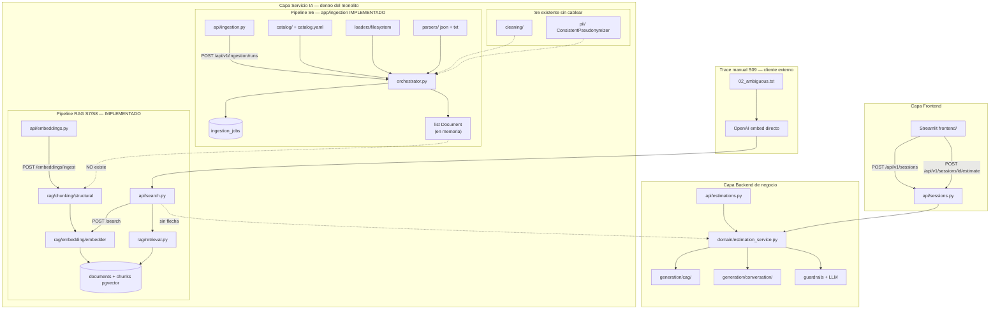
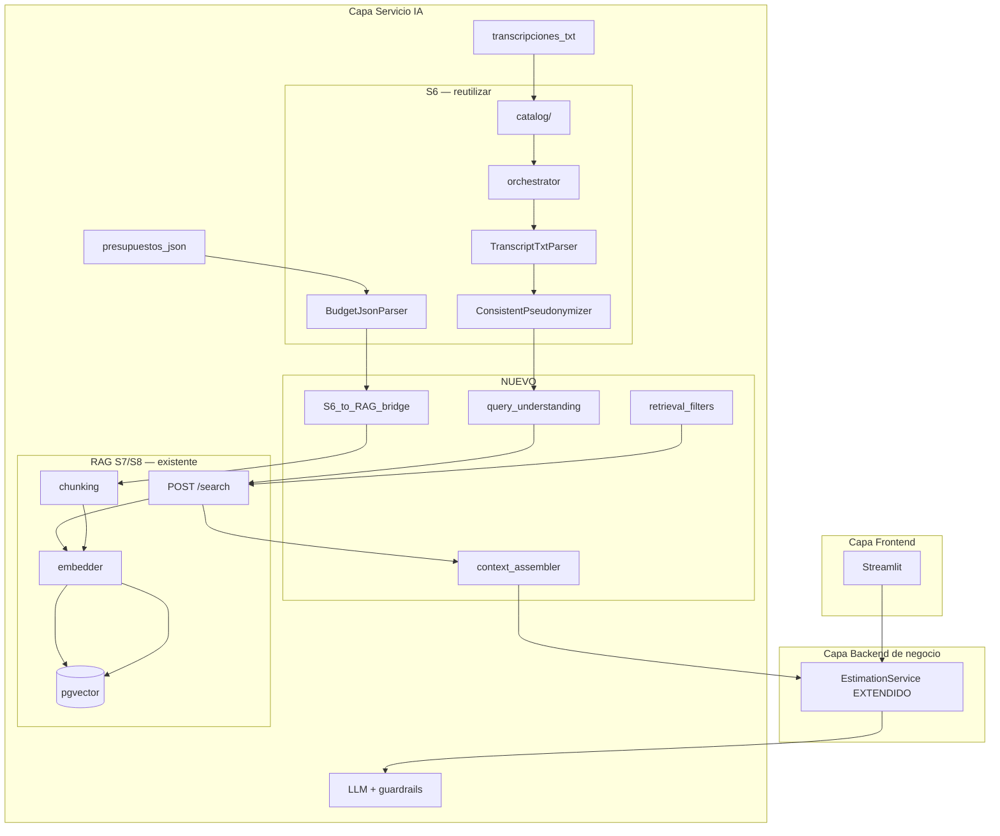

# Diagnóstico arquitectónico — Sesión 09 (pre-work)

> Estado del servicio al cierre de Sesión 08 + subsistema de ingesta S6 implementado en rama
> `S9_Diagnostico_RAG-SVL`. Observaciones en español; comandos, payloads y nombres de campo en inglés.

---

## 1. Diagrama de la arquitectura actual

El estimador es un **monolito FastAPI** en `:8000` (no hay microservicio IA separado). Tres capas lógicas; dentro del servicio IA coexisten **dos pipelines de ingesta sin puente entre ellos**.



### Dónde acaba lo implementado

| Entrada | Camino | Punto final |
|---|---|---|
| Presupuesto JSON vía S6 (`presupuestos_json`) | `catalog` → `FileSystemLoader` → `BudgetJsonParser` → `orchestrator` | `list[Document]` markdown **en memoria** + fila en `ingestion_jobs`. No llega a pgvector. |
| Presupuesto JSON vía HTTP RAG | `POST /embeddings/ingest` → `JSONStructuralChunker` → `OpenAIEmbedder` | Filas en `documents` + `chunks` con `embedding vector(1536)`. |
| Transcripción TXT vía S6 (`transcripciones_txt`) | `TranscriptTxtParser` → 1 `Document` por turno etiquetado | Misma parada en memoria; **no alimenta** `/search`. |
| Transcripción cruda (trace S09) | Cliente `trace_s09.py`: embed OpenAI + `POST /search` | Top-5 chunks de presupuestos históricos. **No hay** estimación generada ni llamada a `EstimationService`. |
| Descripción estructurada (Streamlit) | `POST /api/v1/estimate` o sesión con adjuntos | `EstimationResult` vía LLM + CAG + conversación. **Sin contexto RAG**. |

**Resumen:** el sistema puede vectorizar y buscar presupuestos históricos, y puede parsear transcripciones offline, pero **no existe un camino automatizado** transcripción → retrieval → estimación.

---

## 2. Trace anotado de `02_ambiguous.txt`

Transcripción: reunión ambigua de Rubén Castaño (Casa Castaño, tienda gourmet) — e-commerce vago, fidelización, panel de control, pagos con tarjeta, emails de confirmación.

**Prerrequisitos ejecutados:**

```bash
docker compose up -d
docker compose run --rm estimator alembic upgrade head   # 0001 + 0002
docker compose exec estimator python scripts/ingest_corpus.py   # 15 presupuestos, 61 chunks
curl http://127.0.0.1:8000/health
```

### Paso 1 — Embeber la transcripción completa

**Comando ejecutado** (equivalente a `trace_s09.py`; el script oficial usa el mismo modelo y la misma transcripción):

```bash
export OPENAI_API_KEY=sk-...
uv run examples/trace_s09.py examples/transcripts/02_ambiguous.txt
```

> No existe endpoint HTTP que devuelva el vector crudo; el embedding ocurre dentro de `POST /search`.
> El paso 1 del trace llama a OpenAI directamente con `text-embedding-3-small` (mismo modelo que el servicio).

**Salida (STEP 1):**

```
transcript      : examples/transcripts/02_ambiguous.txt
model           : text-embedding-3-small
dimensionality  : 1536
L2 norm         : 0.999691
first component : 0.006233
last component  : 0.019012
```

**Comentarios:**
- El vector resume la reunión entera (aprox. 2.800 caracteres): diálogo consultor/cliente, timestamps, divagación sobre Francia y la sobrina, y mezcla de necesidades (tienda online, club de puntos, panel, pagos).
- La norma L2 ≈ 1 confirma embedding normalizado.
- Es un embedding de **mucho ruido conversacional** frente a chunks de presupuesto estructurados (~300 tokens con cabeceras `[Project:…]`, sector y componente).
- Existe `TranscriptTxtParser` en S6 (partiría la transcripción en ~10 `Document` por turno), pero **este trace no lo usa** y, aunque lo usara, S6 no escribe en pgvector.

### Paso 2 — Búsqueda semántica (top-5)

**Comando:**

```bash
curl -X POST "http://127.0.0.1:8000/search" \
  -H "Content-Type: application/json" \
  -d '{"query": "<contenido completo de 02_ambiguous.txt>", "k": 5}'
```

(En la práctica, `trace_s09.py` hace este `POST` con el mismo texto embebido en el paso 1.)

**Salida relevante:**

```
search_time_ms  : 336
results         : 5

  rank  chunk_id  distance  sector        budget_id       content (preview)
     1        15    0.5973  ecommerce     BUD-2024-003    Headless e-commerce storefront … Component: Headless storefront (Next.js)
     2        16    0.6174  ecommerce     BUD-2024-003    … Component: Real-time inventory service
     3        17    0.6252  ecommerce     BUD-2024-003    … Component: Recommendation microservice
     4        18    0.6308  ecommerce     BUD-2024-003    … Component: Checkout and payments integration
     5        23    0.6399  ecommerce     BUD-2023-015    … Component: Seller analytics dashboard
```

**Respuesta cruda (JSON):**

```json
{
  "query": "Reunión exploratoria — sin título claro todavía\nCliente: Rubén Castaño …",
  "k": 5,
  "search_time_ms": 336,
  "results": [
    {
      "chunk_id": 15,
      "document_id": 4,
      "chunk_type": "budget_component",
      "content": "[Project: Headless e-commerce storefront with real-time inventory and personalized product recommendations]\n[Client sector: ecommerce | Year: 2024 | Main tech: nextjs]\n\nComponent: Headless storefront (Next.js)\nDescription: SSR/ISR product catalog, cart, and checkout UI consuming Commerce API with i18n for ES/PT markets.\nTech stack: nextjs, react, typescript, vercel\nComplexity: medium\nEstimated hours: 160",
      "distance": 0.5973,
      "metadata": {
        "year": 2024,
        "budget_id": "BUD-2024-003",
        "complexity": "medium",
        "component_id": "STORE-301",
        "client_sector": "ecommerce",
        "estimated_hours": 160,
        "main_technology": "nextjs"
      }
    },
    {
      "chunk_id": 16,
      "document_id": 4,
      "chunk_type": "budget_component",
      "content": "[Project: Headless e-commerce storefront with real-time inventory and personalized product recommendations]\n…\nComponent: Real-time inventory service\nDescription: Stock reservation at checkout, warehouse sync via events, and low-stock alerts to merchandising team.\n…",
      "distance": 0.6174,
      "metadata": {
        "budget_id": "BUD-2024-003",
        "client_sector": "ecommerce",
        "component_id": "INV-302",
        "complexity": "high",
        "estimated_hours": 120
      }
    },
    {
      "chunk_id": 17,
      "document_id": 4,
      "chunk_type": "budget_component",
      "content": "… Component: Recommendation microservice\nDescription: Collaborative filtering pipeline with A/B test hooks and fallback to rule-based bestsellers.\n…",
      "distance": 0.6252,
      "metadata": {
        "budget_id": "BUD-2024-003",
        "client_sector": "ecommerce",
        "component_id": "REC-303",
        "complexity": "high",
        "estimated_hours": 140
      }
    },
    {
      "chunk_id": 18,
      "document_id": 4,
      "chunk_type": "budget_component",
      "content": "… Component: Checkout and payments integration\nDescription: Stripe Payment Element, BNPL provider hook, and order confirmation emails via SendGrid.\n…",
      "distance": 0.6308,
      "metadata": {
        "budget_id": "BUD-2024-003",
        "client_sector": "ecommerce",
        "component_id": "PAY-304",
        "complexity": "medium",
        "estimated_hours": 100
      }
    },
    {
      "chunk_id": 23,
      "document_id": 5,
      "chunk_type": "budget_component",
      "content": "[Project: Multi-vendor marketplace with seller onboarding, commission engine, and dispute resolution]\n…\nComponent: Seller analytics dashboard\nDescription: Sales trends, conversion funnels, and inventory turnover charts embedded in seller portal.\n…",
      "distance": 0.6399,
      "metadata": {
        "budget_id": "BUD-2023-015",
        "client_sector": "ecommerce",
        "component_id": "ANA-405",
        "complexity": "low",
        "estimated_hours": 100
      }
    }
  ]
}
```

**Comentarios:**
- Las cinco distancias coseno caen en un rango estrecho (0.597–0.640, Δ ≈ 0.04) para una query de aprox. 2.800 caracteres frente a chunks de 150–200 palabras.
- El retrieval devuelve solo sector `ecommerce` (coherente con “vender por internet”), pero los cuatro primeros hits son **el mismo presupuesto** (`BUD-2024-003`, headless enterprise) repetido por componente — no hay diversidad ni deduplicación por documento.

### Paso 3 — Lectura de los chunks devueltos

| Rank | Presupuesto | Sector | ¿Relevante para Casa Castaño? |
|---|---|---|---|
| 1 | `BUD-2024-003` — Headless storefront (Next.js) | ecommerce | **Parcial.** Cubre catálogo y checkout online, pero es un headless B2C con i18n ES/PT, no tienda gourmet artesanal. No menciona fidelización ni club de puntos. |
| 2 | `BUD-2024-003` — Real-time inventory service | ecommerce | **Parcial.** Rubén pide control de stock (lleva cuaderno), pero el chunk describe reservas en checkout y sync de almacén enterprise, no panel matutino sencillo. |
| 3 | `BUD-2024-003` — Recommendation microservice | ecommerce | **Débil.** El cliente habla de fidelización/puntos por influencia de su sobrina; este chunk es collaborative filtering técnico, no programa de loyalty. |
| 4 | `BUD-2024-003` — Checkout and payments (Stripe) | ecommerce | **Bueno en pagos.** Alineado con “que la gente pueda pagar con tarjeta” y emails de confirmación (SendGrid). Es el match más directo de una necesidad concreta. |
| 5 | `BUD-2023-015` — Seller analytics dashboard | ecommerce | **Parcial en panel.** Es un dashboard de vendedores en marketplace multi-vendor, no un panel de pedidos/stock para el gerente de una tienda única. |

**Balance honesto:** El retrieval acierta el **dominio** (e-commerce) y recupera pagos y algo de inventario/analytics, pero **no distingue** fidelización vs recomendaciones, ni panel sencillo vs marketplace B2B. Ningún chunk menciona gourmet, conservas ni el contexto de pyme familiar. El trace termina aquí: no hay estimación generada.

---

## 3. Diagnóstico: cinco fallos identificados

### Fallo 1 — Query cruda sin reformulación de intención

- **Problema observado:** `POST /search` recibe la transcripción completa (~2.800 caracteres). Las distancias del top-5 se comprimen entre 0.597 y 0.640; cuatro chunks pertenecen al mismo `BUD-2024-003`, mezclando storefront, inventario, recomendaciones y pagos sin priorizar lo que Rubén enfatiza (panel y pagos).
- **Causa probable:** No hay etapa que extraiga una query compacta (p. ej. “e-commerce gourmet, panel de ventas, pagos Stripe, loyalty básico”). S6 parsea turnos pero no produce queries de retrieval.
- **Propuesta de solución:** Módulo de *query understanding* que, desde turnos o resumen estructurado, genere 1–3 consultas cortas orientadas a retrieval antes de llamar a `/search`.

### Fallo 2 — Dos pipelines de ingesta desconectados

- **Problema observado:** El índice vectorial solo contiene presupuestos ingeridos vía `POST /embeddings/ingest` / `ingest_corpus.py`. Ejecutar `TranscriptTxtParser` (S6) sobre `02_ambiguous.txt` no altera los resultados de `/search`.
- **Causa probable:** `orchestrator.ingest_source` devuelve `list[Document]` en memoria y actualiza `ingestion_jobs`, pero no invoca chunker, embedder ni `create_document_with_chunks`. Coexisten S6 (bytes → Document) y RAG (Budget JSON → pgvector) sin puente.
- **Propuesta de solución:** Conector explícito S6 → RAG: `Document` → estrategia de chunking → `OpenAIEmbedder` → persistencia en `documents`/`chunks` (o al menos publicar transcripciones procesadas al índice).

### Fallo 3 — RAG desacoplado de la estimación

- **Problema observado:** El trace recupera cinco chunks con horas estimadas y stack tecnológico, pero no hay respuesta de estimación. `EstimationService` no importa `search_chunks_by_cosine`; `POST /api/v1/estimate` espera `description` + `project_type`, no contexto histórico.
- **Causa probable:** Las capas `generation/rag` y `domain/estimation_service` se componen solo para CAG/conversación/LLM; retrieval vive aislado en `api/search.py`.
- **Propuesta de solución:** Extender `EstimationService` con un paso retrieve → augment → generate que inyecte chunks recuperados en el prompt de estimación.

### Fallo 4 — Asimetría de granularidad query vs chunks

- **Problema observado:** Un embedding de la reunión entera compite con chunks de un solo componente de presupuesto (`budget_component`, ~300 tokens con cabecera estructurada). El top-4 son variaciones del mismo proyecto enterprise headless, no una visión holística del presupuesto ni de la reunión.
- **Causa probable:** `JSONStructuralChunker` genera 1 chunk = 1 componente; la query es un documento conversacional largo. No hay estrategia de alineación (resumen de reunión, multi-query, o chunking de transcripción para retrieval).
- **Propuesta de solución:** *Context assembler* que agregue chunks por `budget_id`, limite diversidad, y/o genere embeddings de resúmenes intermedios antes del match coseno.

### Fallo 5 — PII y cleaning fuera del camino crítico

- **Problema observado:** La transcripción contiene “Rubén Castaño”, “Casa Castaño” y datos personales; el trace embebe el texto tal cual hacia OpenAI y lo compara con chunks indexados sin pseudonimizar. `ConsistentPseudonymizer` y `cleaning/` existen en `app/ingestion/pii/` y `cleaning/` pero el orquestador no los invoca.
- **Causa probable:** S6 implementó PII y limpieza tabular como módulos independientes sin integrarlos en `ingest_source` ni en el flujo del trace/cliente.
- **Propuesta de solución:** Cablear `ConsistentPseudonymizer` en el pipeline S6 (y en cualquier camino que envíe texto a embedders externos) antes de persistir o buscar.

### Otros (opcional)

- **Gobernanza de fuentes resuelta en S6:** `catalog.yaml` con decisiones `include`/`exclude` y sensibilidad PII — avance real, no fallo.
- **Metadata `client_sector` ignorada en retrieval:** podría haber filtrado a `ecommerce` antes del ranking; hoy `retrieval.py` solo hace `ORDER BY distance LIMIT k`.
- **Sin deduplicación por documento:** cuatro de cinco hits son el mismo `budget_id`; un reranker o agrupación por documento mejoraría la lectura humana del contexto.

---

## 4. Propuesta de evolución arquitectónica

Misma topología de tres capas. Las cajas **EXISTENTES (S6)** se reutilizan; las **NUEVAS** cierran el bucle transcripción → estimación.



| Módulo | Estado | Responsabilidad |
|---|---|---|
| `TranscriptTxtParser` + `catalog/` | Existente | Parsear transcripciones a turnos `Document` |
| `ConsistentPseudonymizer` | Existente, cablear | Sustituir PII antes de embed/search |
| `query_understanding` | **Nuevo** | Turnos/resumen → query corta para retrieval |
| `S6_to_RAG_bridge` | **Nuevo** | `Document` → chunk → embed → persist |
| `retrieval_filters` | **Nuevo** | Pre-filtro por `client_sector`, dedup por `budget_id` |
| `context_assembler` | **Nuevo** | Top-k chunks → bloque de contexto para el prompt |
| `EstimationService` | Extender | Orquestar retrieve → augment → generate |

**Flujo de datos:** `02_ambiguous.txt` → turnos pseudonimizados → resumen/query (“e-commerce gourmet, panel ventas, pagos, loyalty ligero”) → vector → chunks de presupuestos `ecommerce` filtrados y diversificados → bloque de contexto con horas/stack históricos → prompt enriquecido → `EstimationResult`.

**Pieza más crítica:** el **puente S6 → RAG** junto con **query understanding**. Sin una query compacta y sin conectar los parsers ya construidos al índice vectorial, el resto (assembler, filtros, cableado en `EstimationService`) no tiene material útil que recuperar. Si solo pudiera construir una pieza primero, atacaría **query understanding**, porque el trace demuestra que embeber la transcripción entera produce rankings comprimidos y repetitivos aunque el dominio (ecommerce) sea correcto.
